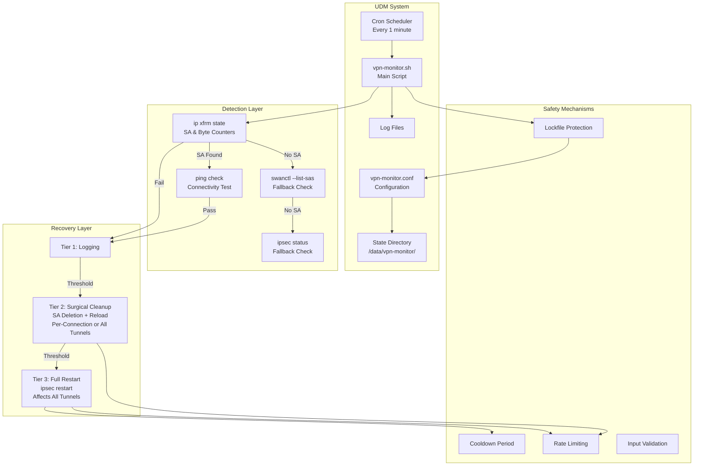
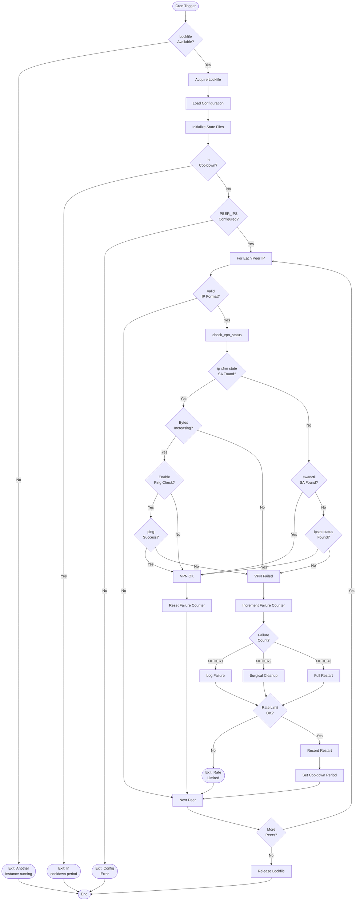
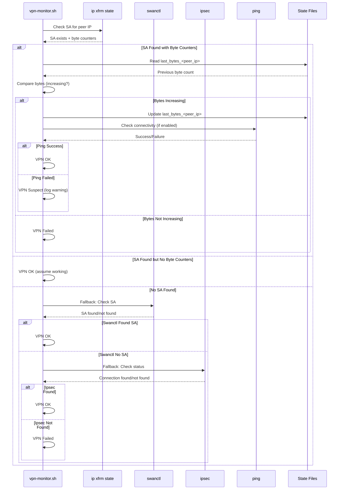
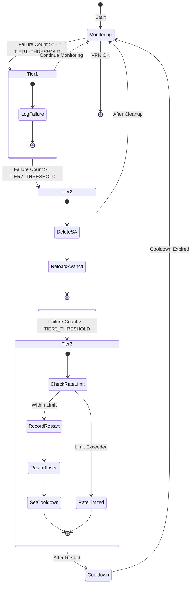
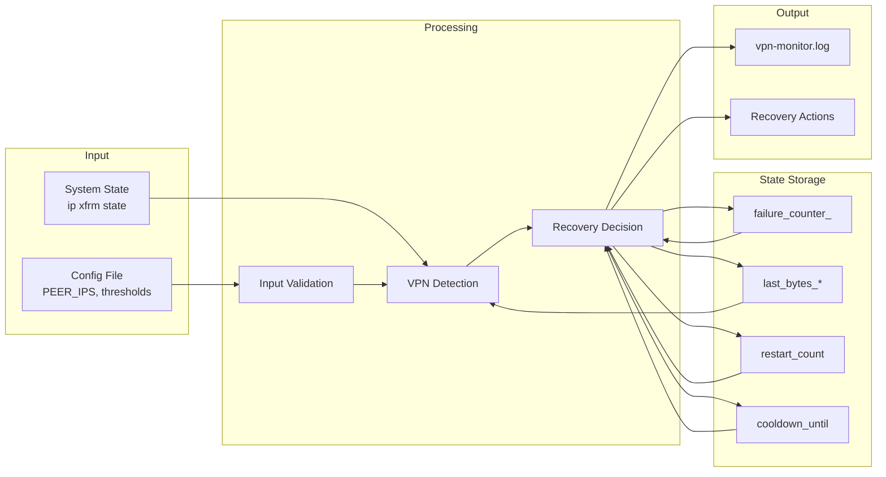
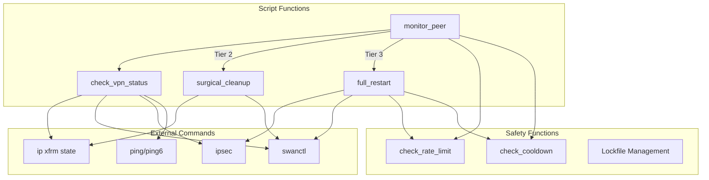

# Architecture Documentation

This document describes the architecture and design of the UDM VPN Monitor system.

## System Overview

```
┌─────────────────────────────────────────────────────────────────┐
│                    UniFi Dream Machine (UDM)                    │
│                                                                 │
│  ┌──────────────────────────────────────────────────────────┐  │
│  │              Cron Scheduler (every 1 min)                │  │
│  └────────────────────┬─────────────────────────────────────┘  │
│                       │                                         │
│                       ▼                                         │
│  ┌──────────────────────────────────────────────────────────┐  │
│  │              vpn-monitor.sh (Main Script)                 │  │
│  │  ┌────────────────────────────────────────────────────┐  │  │
│  │  │  Lockfile Protection (flock or atomic file)        │  │  │
│  │  └────────────────────────────────────────────────────┘  │  │
│  │                       │                                     │  │
│  │                       ▼                                     │  │
│  │  ┌────────────────────────────────────────────────────┐  │  │
│  │  │  Configuration Loading (vpn-monitor.conf)          │  │  │
│  │  └────────────────────────────────────────────────────┘  │  │
│  │                       │                                     │  │
│  │                       ▼                                     │  │
│  │  ┌────────────────────────────────────────────────────┐  │  │
│  │  │  State Initialization & Cooldown Check            │  │  │
│  │  └────────────────────────────────────────────────────┘  │  │
│  │                       │                                     │  │
│  │                       ▼                                     │  │
│  │  ┌────────────────────────────────────────────────────┐  │  │
│  │  │  For Each Peer IP: monitor_peer()                  │  │  │
│  │  └────────────────────────────────────────────────────┘  │  │
│  └──────────────────────────────────────────────────────────┘  │
│                                                                 │
│  ┌──────────────────────────────────────────────────────────┐  │
│  │  State Files (/data/vpn-monitor/)                        │  │
│  │  • last_bytes_<peer_ip>                                  │  │
│  │  • cooldown_until                                        │  │
│  │  • vpn-monitor.lock                                      │  │
│  └──────────────────────────────────────────────────────────┘  │
│                                                                 │
│  ┌──────────────────────────────────────────────────────────┐  │
│  │  Log Files (/data/vpn-monitor/logs/)                     │  │
│  │  • vpn-monitor.log                                       │  │
│  │  • failure_counter_<peer_ip>  # Per-peer failure count │  │
│  │  • restart_count                                         │  │
│  │  • cron.log                                             │  │
│  └──────────────────────────────────────────────────────────┘  │
└─────────────────────────────────────────────────────────────────┘
```

## Component Architecture



## Execution Flow



## Detection Method Flow



## Recovery Tier Flow



## Data Flow



## File Structure

```
/data/vpn-monitor/
├── vpn-monitor.sh              # Main monitoring script
├── vpn-monitor.conf            # Configuration file
├── vpn-monitor.lock            # Lockfile (timestamp:pid format)
│
├── logs/                       # Logs directory
│   ├── vpn-monitor.log         # Main log file
│   ├── failure_counter_<peer_ip>  # Per-peer failure count (sanitized IP in filename)
│   └── restart_count           # Timestamps of all restarts
│
├── State Files:
├── last_restart                # Last restart timestamp
├── cooldown_until              # Cooldown expiration timestamp
├── last_bytes_192_168_1_1     # Per-peer byte counters
├── last_bytes_192_168_2_1     # (sanitized IP in filename)
└── .cron_checked              # Flag file for cron check
```

## Component Interactions



## Key Design Decisions

### 1. Cron-Based Execution
- **Why**: More resilient than long-running daemons on UDM
- **Trade-off**: Less frequent checks (5 min vs continuous)
- **Benefit**: Survives system restarts, simpler error handling

### 2. Lockfile Protection
- **Why**: Prevent multiple instances from running simultaneously
- **Implementation**: `flock` (preferred) or atomic file creation (fallback)
- **Enhancement**: Timeout detection for hung processes

### 3. Tiered Recovery
- **Why**: Gradual escalation prevents unnecessary disruption
- **Tiers**: Log → Cleanup → Restart
- **Benefit**: Most issues resolved without full restart

### 4. Per-Peer State Tracking
- **Why**: Multiple peers need independent monitoring and recovery
- **Implementation**: Separate state files per peer (sanitized IP)
  - Per-peer failure counters: `failure_counter_<peer_ip>`
  - Per-peer byte counters: `last_bytes_<peer_ip>`
- **Benefit**: Accurate detection and independent recovery for multi-peer setups
- **Note**: Both failure counters and byte counters are tracked per-peer, allowing independent failure tracking and recovery actions

### 5. Dual Detection Method
- **Why**: xfrm shows tunnel state, ping verifies connectivity
- **Implementation**: xfrm primary, ping optional verification
- **Benefit**: Distinguishes "idle" from "broken"

### 6. Shared Library and Helper Functions
- **Why**: Reduce code duplication and improve maintainability
- **Implementation**: `lib/common.sh` provides shared logging and utility functions
- **Helper Functions**: 
  - `get_formatted_timestamp()` - Consistent date formatting
  - `ensure_directory_exists()` - Centralized directory creation
  - `log_and_exit_lockfile_conflict()` - Consistent lockfile conflict handling
  - `extract_lockfile_pid()` - Lockfile PID extraction
  - `is_process_running()` - Process existence checking
  - `create_lockfile_atomically()` - Atomic lockfile creation
  - `get_file_mtime()` - Cross-platform file modification time
  - `validate_ip_address()` - Robust IP address validation (IPv4/IPv6)
- **Benefit**: Consistent error handling, reduced duplication, easier maintenance

### 7. Rate Limiting
- **Why**: Prevent restart loops if VPN has persistent issues
- **Implementation**: Track restart timestamps, limit per hour
- **Benefit**: Protects system from excessive restarts

### 7. Cooldown Period
- **Why**: Allow VPN to stabilize after restart
- **Implementation**: Skip checks for configured minutes after restart
- **Benefit**: Prevents false positives immediately after recovery

## Error Handling Strategy

1. **Fail-Safe Defaults**: Script exits gracefully on errors
2. **Logging**: All errors logged with context
3. **Fallbacks**: Multiple detection methods (xfrm → swanctl → ipsec)
4. **Validation**: Input validation prevents injection attacks
5. **State Recovery**: Stale lockfiles automatically cleaned up

## Performance Considerations

- **Execution Time**: Typically < 30 seconds per run
- **Resource Usage**: Minimal (bash script, no daemon)
- **State File Size**: Small (few KB per peer)
- **Log Rotation**: Manual (could be enhanced with logrotate)

## Security Considerations

- **Input Validation**: Peer IPs validated before use
- **File Permissions**: State files readable/writable by script only
- **No External Network**: Only local system commands (except ping)
- **Config Sourcing**: Validated before sourcing config file

