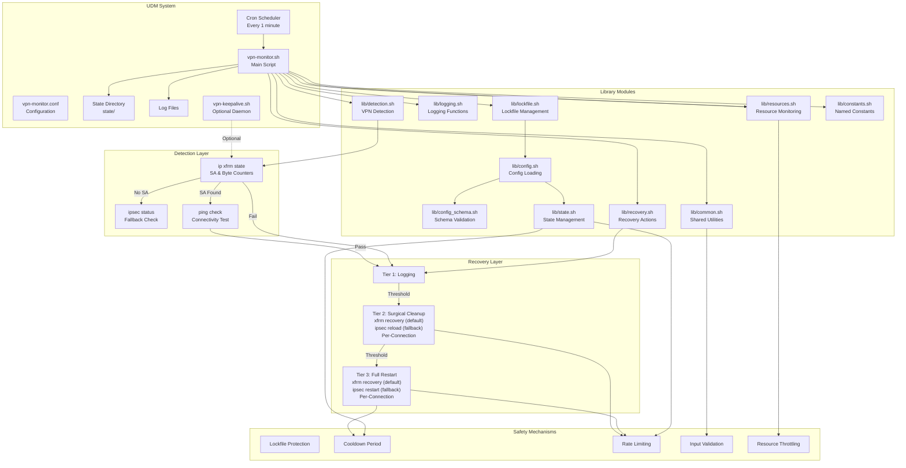
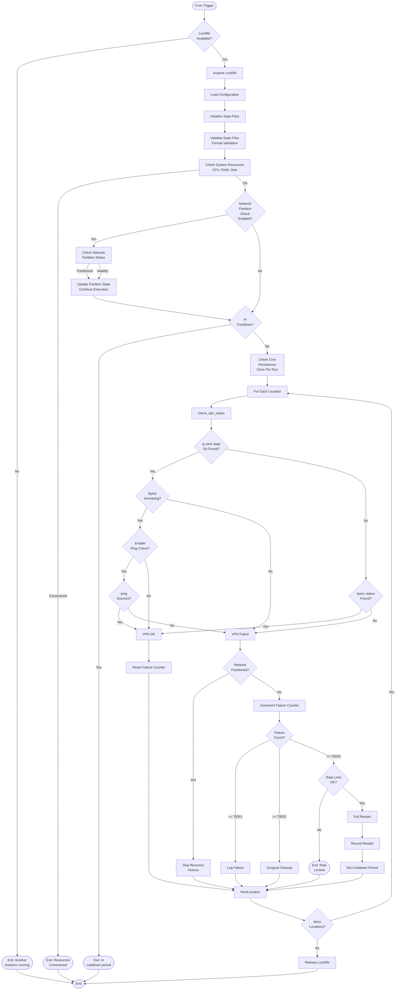
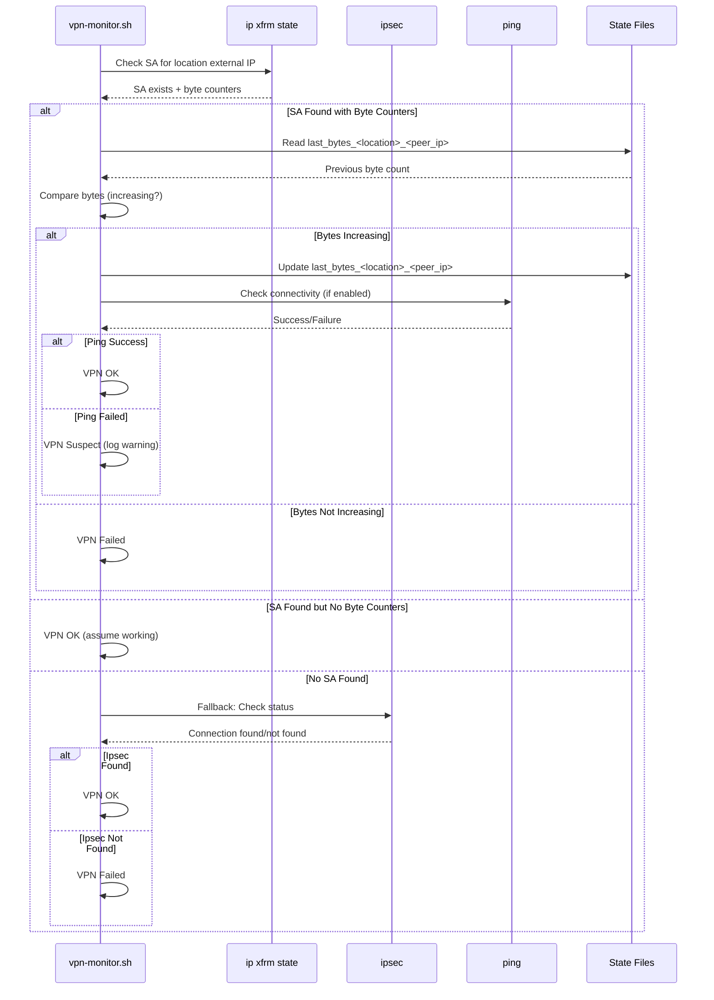
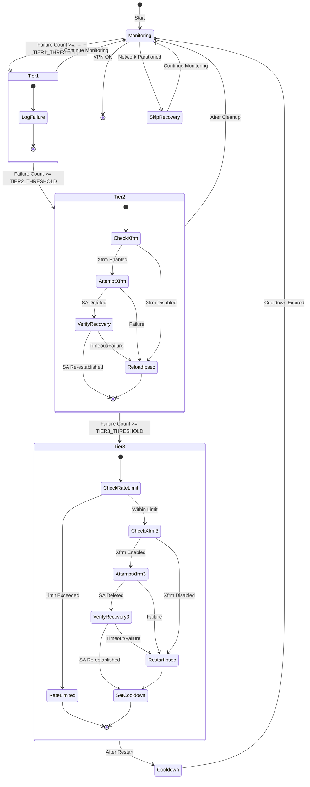
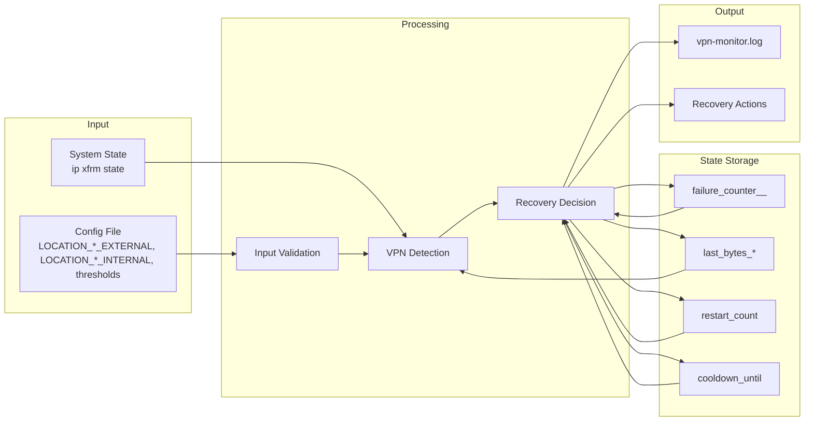
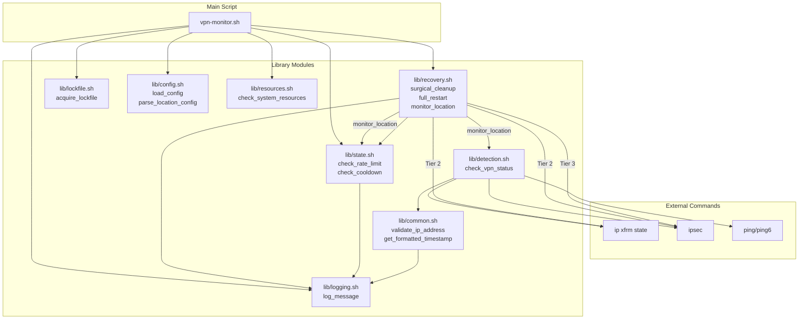

# Architecture Documentation

This document describes the architecture and design of the UDM VPN Monitor system.

## System Overview

```
┌─────────────────────────────────────────────────────────────────┐
│                    UniFi Dream Machine (UDM)                    │
│                                                                 │
│  ┌──────────────────────────────────────────────────────────┐  │
│  │              Cron Scheduler (every 1 min)                │  │
│  └────────────────────┬─────────────────────────────────────┘  │
│                       │                                         │
│                       ▼                                         │
│  ┌──────────────────────────────────────────────────────────┐  │
│  │              vpn-monitor.sh (Main Script)                 │  │
│  │  ┌────────────────────────────────────────────────────┐  │  │
│  │  │  lib/lockfile.sh - Lockfile Protection            │  │  │
│  │  │  (flock or atomic file)                           │  │  │
│  │  └────────────────────────────────────────────────────┘  │  │
│  │                       │                                     │  │
│  │                       ▼                                     │  │
│  │  ┌────────────────────────────────────────────────────┐  │  │
│  │  │  lib/config.sh - Configuration Loading            │  │  │
│  │  │  lib/config_schema.sh - Schema Validation        │  │  │
│  │  └────────────────────────────────────────────────────┘  │  │
│  │                       │                                     │  │
│  │                       ▼                                     │  │
│  │  ┌────────────────────────────────────────────────────┐  │  │
│  │  │  lib/state.sh - State Initialization              │  │  │
│  │  │  lib/logging.sh - Logging Functions              │  │  │
│  │  └────────────────────────────────────────────────────┘  │  │
│  │                       │                                     │  │
│  │                       ▼                                     │  │
│  │  ┌────────────────────────────────────────────────────┐  │  │
│  │  │  lib/resources.sh - Resource Monitoring           │  │  │
│  │  │  (CPU, RAM, disk space throttling)               │  │  │
│  │  └────────────────────────────────────────────────────┘  │  │
│  │                       │                                     │  │
│  │                       ▼                                     │  │
│  │  ┌────────────────────────────────────────────────────┐  │  │
│  │  │  For Each Location:                               │  │  │
│  │  │  lib/recovery.sh - monitor_location()             │  │  │
│  │  │  ┌──────────────────────────────────────────────┐ │  │  │
│  │  │  │  lib/detection.sh - VPN Status Check        │ │  │  │
│  │  │  └──────────────────────────────────────────────┘ │  │  │
│  │  │  ┌──────────────────────────────────────────────┐ │  │  │
│  │  │  │  lib/recovery.sh - Recovery Actions         │ │  │  │
│  │  │  │  (surgical_cleanup, full_restart)          │ │  │  │
│  │  │  └──────────────────────────────────────────────┘ │  │  │
│  │  └────────────────────────────────────────────────────┘  │  │
│  └──────────────────────────────────────────────────────────┘  │
│                                                                 │
│  ┌──────────────────────────────────────────────────────────┐  │
│  │  Optional: VPN Keepalive Daemon                           │  │
│  │  ┌────────────────────────────────────────────────────┐  │  │
│  │  │  vpn-keepalive.sh (systemd service)              │  │  │
│  │  │  Sends periodic ping traffic through VPN tunnels │  │  │
│  │  │  Prevents idle timeout, keeps tunnels alive     │  │  │
│  │  └────────────────────────────────────────────────────┘  │  │
│  └──────────────────────────────────────────────────────────┘  │
│                                                                 │
│  ┌──────────────────────────────────────────────────────────┐  │
│  │  State Files (${SCRIPT_DIR}/state/)                       │  │
│  │  • last_bytes_<location>_<peer_ip>                      │  │
│  │  • cooldown_until                                        │  │
│  │  • vpn-monitor.lock                                      │  │
│  └──────────────────────────────────────────────────────────┘  │
│                                                                 │
│  ┌──────────────────────────────────────────────────────────┐  │
│  │  Log Files (${SCRIPT_DIR}/logs/)                        │  │
│  │  • vpn-monitor.log                                       │  │
│  │  • failure_counter_<location>_<peer_ip>  # Per-location (in state/) │  │
│  │  • restart_count (in state/)                            │  │
│  └──────────────────────────────────────────────────────────┘  │
└─────────────────────────────────────────────────────────────────┘
```

## Component Architecture



## Execution Flow



**Note**: 
- **Execution Order**: The actual execution flow includes more steps than shown in simplified form above. Full order: Directory creation → Config loading → Config validation → Lockfile acquisition → Initialize monitor (parse args, init state) → State validation → Resource check → Network partition check → Cooldown check → Cron persistence check → Location processing.

- **State Validation**: State files are validated for format correctness (integer, timestamp, timestamp_list) early in execution (after state initialization). Corrupted files are automatically detected, backed up, and recovered with safe defaults. This validation step ensures state file integrity before proceeding.

- **Resource Monitoring**: Checks CPU, RAM, and disk space usage early in the execution flow (after state validation). If system resources are severely constrained, the script exits early to avoid adding load to an already stressed system. This throttling mechanism prevents the monitor from contributing to system overload.

- **Network Partition Check**: (if enabled via `ENABLE_NETWORK_PARTITION_CHECK`) occurs before cooldown check to ensure partition detection works even during cooldown periods. This timing is intentional - if the network is partitioned, VPN checks should be skipped regardless of cooldown status. When network is partitioned, the script updates partition state and continues execution (does not exit early). Recovery actions later check partition state and skip recovery if network is partitioned, allowing VPN checks to proceed but preventing unnecessary recovery actions.

- **Cron Persistence Check**: Performed once per run (tracked via `.cron_checked` file) after cooldown check. Detects if cron jobs were removed during system upgrades (common after UniFi OS updates). Logs warnings but doesn't fail execution - this is a diagnostic check to help users detect configuration loss.

## Detection Method Flow



### Ping Check Behavior

The ping check provides additional connectivity verification beyond SA state checks. It's important to understand how ping failures interact with SA state:

**Scenario 1: SA Exists But Ping Fails**
- **Behavior**: VPN is marked as **OK** (SA check passes), but a **WARNING** is logged
- **Reasoning**: The Security Association exists, indicating the tunnel is established at the IPsec level. The ping failure suggests the tunnel may not be routing traffic correctly, but the SA state is still valid
- **Impact**: The tunnel passes the primary check (SA exists), allowing it to remain active while warning about connectivity issues
- **Escalation**: If ping continues to fail, byte counters should also stop increasing (no traffic flowing), which will eventually trigger a failure when byte counters don't increase. This provides a natural escalation path: ping warnings → byte counter failure → recovery actions
- **Use Case**: Helps detect cases where the tunnel is established but routing is broken, without immediately failing on transient ping issues

**Scenario 2: SA Doesn't Exist But Ping Succeeds**
- **Behavior**: VPN is marked as **FAILED** (SA check fails), but a **WARNING** is logged
- **Reasoning**: No Security Association exists, so the VPN tunnel is down. However, ping succeeds, indicating connectivity exists via another route (not through the VPN tunnel)
- **Impact**: The tunnel fails the primary check (no SA), triggering normal failure handling. The ping success warning helps distinguish between "no connectivity at all" vs "connectivity exists but not through VPN"
- **Use Case**: Helps identify when connectivity exists via alternative routes (e.g., direct internet, other VPNs) even though the monitored tunnel is down

**Design Rationale**:
The ping check is designed as a **supplementary diagnostic tool**, not a hard failure condition. The primary detection method (SA state + byte counters) remains the authoritative source for tunnel health. Ping checks provide early warning of connectivity issues while allowing the more reliable byte counter method to confirm actual traffic flow problems before triggering recovery actions.

If validation fails (based on SA state and byte counters), it escalates through recovery tiers. The ping check helps distinguish between "tunnel exists but broken" and "tunnel exists and working but idle".

## Recovery Tier Flow



**Note**: Network partition check also occurs after VPN check fails. When a VPN failure is detected, the failure counter is incremented first (to track the failure even if recovery is skipped), then network partition state is checked. If network is partitioned when a VPN failure is detected, recovery actions are skipped to avoid unnecessary disruption, but the failure count is still incremented for tracking purposes.

## Data Flow



## State Management

The system uses file-based state management to track VPN health, failure counts, recovery actions, and system state across execution cycles. All state is persisted relative to the script location (`${SCRIPT_DIR}/`) to survive reboots.

**Note**: Paths are relative to the script location, not hardcoded absolute paths. The script sets `SCRIPT_DIR` to its own directory location. When installed to `/data/vpn-monitor`, `SCRIPT_DIR` resolves to `/data/vpn-monitor`, so state files are created at `/data/vpn-monitor/state/` and `/data/vpn-monitor/logs/`. This design allows the script to work in dev mode or if installed to a different location.

### State Files Overview

State files are organized into two categories:

**Per-Location State Files** (tracked independently for each VPN location):
- `${STATE_DIR}/failure_counter_<location>_<peer_ip>`: Consecutive failure count per location (sanitized location name and IP in filename).
- `${STATE_DIR}/last_bytes_<location>_<peer_ip>`: Last known byte counter value per location (sanitized location name and IP in filename)
- `${STATE_DIR}/failure_type_<location>_<peer_ip>`: Tracks failure type for diagnostic purposes (cleared on recovery)
- `${STATE_DIR}/spi_<location>_<peer_ip>`: Stores SPI (Security Parameter Index) for location connection tracking
- `${STATE_DIR}/idle_detected_<location>_<peer_ip>`: Tracks idle detection state for the location
- `${STATE_DIR}/last_status_log_<location>_<peer_ip>`: Timestamp of last status log entry for the location

**System-Wide State Files** (shared across all peers):
- `${STATE_DIR}/cooldown_until`: Cooldown expiration timestamp (prevents immediate re-restarts)
- `${STATE_DIR}/restart_count`: Unix timestamps of Tier 3 recovery actions (one timestamp per line, for rate limiting) - see [Rate Limiting](#rate-limiting-staterestart_count) section below for details
- `${STATE_DIR}/network_partition_state`: Network partition status (0 = healthy, 1 = partitioned) - used to detect network connectivity issues that affect all peers
- `${STATE_DIR}/vpn-monitor.lock`: Lockfile for execution control (format: `timestamp:pid` for timeout detection)
- `${STATE_DIR}/.cron_checked`: Flag file to prevent repeated cron persistence checks

**Note**: `STATE_DIR` defaults to `${SCRIPT_DIR}/state` and `LOGS_DIR` defaults to `${SCRIPT_DIR}/logs`. These can be overridden via configuration. When installed to `/data/vpn-monitor`, these resolve to `/data/vpn-monitor/state` and `/data/vpn-monitor/logs` respectively.

### Per-Location State Tracking

The monitor tracks state independently for each configured location, enabling independent monitoring and recovery actions for multiple VPN tunnels. This is essential when monitoring multiple Site-to-Site VPN connections, as failures in one location should not affect the monitoring or recovery of other locations.

**Location-Based Configuration**:
VPNs are configured using location-based variables:
- `LOCATION_<NAME>_EXTERNAL`: External/public IP address of the remote VPN gateway
- `LOCATION_<NAME>_INTERNAL`: Internal/private IP address(es) for ping checks (optional, space-separated)
- Location names are automatically extracted from variable names (text between `LOCATION_` and `_EXTERNAL`)
- For locations with multiple internal IPs, VPN is considered healthy if ≥30% respond to pings

**File Naming Convention**:
All per-location state files use sanitized location names and peer IP addresses in their filenames:
- Location names are sanitized: invalid characters replaced with underscores, max 64 chars
- IP addresses are sanitized: dots and colons replaced with underscores (e.g., `192.168.1.1` becomes `192_168_1_1`)
- Format: `<key>_<location>_<peer_ip>` (e.g., `failure_counter_NYC_203_0_113_1`)
- This ensures safe filenames while maintaining uniqueness per location

**Per-Location State Files**:

1. **Failure Counters** (`state/failure_counter_<location>_<peer_ip>`)
   - **Purpose**: Tracks consecutive failure count for each location independently
   - **Creation**: Created on-demand when a location first fails
   - **Usage**: Used to determine which recovery tier to trigger (Tier 1, 2, or 3)
   - **Independence**: Each location has its own counter. For example:
     - Location NYC (`203.0.113.1`) failing 3 times → triggers Tier 2 recovery for NYC
     - Location DC (`198.51.100.1`) failing 2 times → triggers Tier 1 logging for DC
     - These are tracked completely independently
   - **Reset**: Counter resets to 0 when VPN check succeeds for that location
   - **Location**: Stored in `${STATE_DIR}` directory (defaults to `${SCRIPT_DIR}/state`, typically `/data/vpn-monitor/state/` when installed)

2. **Byte Counters** (`last_bytes_<location>_<peer_ip>`)
   - **Purpose**: Stores the last known byte counter value from `ip xfrm state` for each location
   - **Creation**: Created on-demand when byte counters are first read for a location
   - **Usage**: Used to detect if byte counters are increasing (indicating active traffic flow)
   - **Independence**: Each location has its own byte counter file, allowing independent traffic flow detection
   - **Update**: Updated each time a successful check reads increasing byte counters
   - **Location**: Stored in `${STATE_DIR}` directory (defaults to `${SCRIPT_DIR}/state`, typically `/data/vpn-monitor/state/` when installed)

3. **Failure Type** (`failure_type_<location>_<peer_ip>`)
   - **Purpose**: Tracks the type of failure for diagnostic purposes (e.g., "tunnel_down", "routing_issue")
   - **Creation**: Created on-demand when failure type is determined during VPN check failure
   - **Usage**: Used to provide more detailed failure information in logs (e.g., "VPN check failed (tunnel down)" vs "VPN check failed (routing issue)")
   - **Independence**: Each location has its own failure type file
   - **Clear**: Automatically cleared (deleted) when VPN recovers after failures
   - **Location**: Stored in `${STATE_DIR}` directory

4. **SPI (Security Parameter Index)** (`spi_<location>_<peer_ip>`)
   - **Purpose**: Stores the SPI value extracted from `ip xfrm state` output for each location
   - **Creation**: Created on-demand when SPI is first extracted from xfrm state
   - **Usage**: Used to detect SA (Security Association) rekeys - when SPI changes, it indicates the SA was rekeyed and byte counters may have been reset
   - **Format**: Can be stored in hex format (0x12345678) or decimal format (12345678), matching the format from xfrm output
   - **Independence**: Each location has its own SPI file, allowing independent SA rekey detection
   - **Update**: Updated when SPI is read from xfrm state
   - **Location**: Stored in `${STATE_DIR}` directory

5. **Idle Detection** (`idle_detected_<location>_<peer_ip>`)
   - **Purpose**: Tracks when a tunnel is detected as idle (bytes not increasing but tunnel is healthy)
   - **Creation**: Created on-demand when idle state is detected
   - **Usage**: Set to "1" when tunnel is idle but healthy (SA exists, bytes not increasing, but ping check succeeds). Cleared when traffic resumes (bytes start increasing again) or when SA rekeys
   - **Independence**: Each location has its own idle detection state
   - **Clear**: Automatically cleared when traffic resumes or SA rekeys
   - **Location**: Stored in `${STATE_DIR}` directory

6. **Last Status Log** (`last_status_log_<location>_<peer_ip>`)
   - **Purpose**: Stores the Unix timestamp of the last periodic "VPN OK" status log entry for each location
   - **Creation**: Created on-demand when first periodic status log is written
   - **Usage**: Used to throttle periodic status logging - prevents log spam by only logging "VPN OK" messages at configured intervals (default: every 5 minutes via `STATUS_LOG_INTERVAL_SECONDS`)
   - **Independence**: Each location has its own last status log timestamp, allowing independent throttling per location
   - **Update**: Updated each time a periodic status log entry is written
   - **Location**: Stored in `${STATE_DIR}` directory

**Benefits of Per-Location Tracking**:
- **Independent Recovery**: Each tunnel can be recovered independently based on its own failure count
- **Accurate Detection**: Byte counter tracking per location ensures accurate detection of traffic flow issues for each tunnel
- **Multi-Tunnel Support**: Enables monitoring of multiple VPN locations without interference between them
- **Granular Logging**: Failure counters and recovery actions are tracked per location, making troubleshooting easier
- **Multiple Internal IPs**: Supports multiple internal IPs per location with 30% ping threshold for health determination

**Example Scenario**:
If monitoring three VPN locations (NYC, DC, Chicago), the monitor creates separate state files for each location:
- `state/failure_counter_NYC_203_0_113_1` - tracks failures for NYC location
- `state/failure_counter_DC_198_51_100_1` - tracks failures for DC location  
- `state/failure_counter_CHICAGO_192_0_2_1` - tracks failures for Chicago location
- `state/last_bytes_NYC_203_0_113_1` - tracks byte counters for NYC location
- `state/last_bytes_DC_198_51_100_1` - tracks byte counters for DC location
- `state/last_bytes_CHICAGO_192_0_2_1` - tracks byte counters for Chicago location
- `state/failure_type_NYC_203_0_113_1` - tracks failure type for NYC location (if failed)
- `state/spi_NYC_203_0_113_1` - tracks SPI for NYC location (if SA exists)
- `state/idle_detected_NYC_203_0_113_1` - tracks idle state for NYC location (if idle)
- `state/last_status_log_NYC_203_0_113_1` - tracks last status log timestamp for NYC location

Each peer's monitoring and recovery actions operate completely independently.

### System-Wide State Files

**Cooldown Period** (`cooldown_until`):
- **Purpose**: Prevents immediate re-restarts after a recovery action
- **Mechanism**: After Tier 3 recovery (full restart), a cooldown period is set
- **Duration**: Configurable via `COOLDOWN_MINUTES` (default: 15 minutes)
- **Behavior**: During cooldown, monitoring continues but recovery actions are skipped

**Rate Limiting** (`state/restart_count`):
- **Purpose**: Prevents restart loops if VPN has persistent issues
- **Mechanism**: Tracks Unix timestamps (one per line) of Tier 3 recovery actions only
  - Records full IPsec restarts (`ipsec restart`) that affect all tunnels
  - Also records successful xfrm-based per-connection recovery (when enabled)
  - Does NOT record Tier 1 (logging) or Tier 2 (surgical cleanup) actions
  - Automatically cleans up entries older than 24 hours
- **Limit**: Configurable via `MAX_RESTARTS_PER_HOUR` (default: 3 restarts per hour)
- **Behavior**: If limit exceeded, Tier 3 recovery actions are skipped until rate limit window expires

**Network Partition State** (`network_partition_state`):
- **Purpose**: Tracks network connectivity status to distinguish VPN failures from network partition issues
- **Mechanism**: Stores a single integer value (0 = healthy, 1 = partitioned)
- **Usage**: Used by recovery logic to avoid unnecessary VPN recovery actions when network connectivity is down
- **Detection**: Network partition check uses DNS queries to external servers (configurable via `NETWORK_PARTITION_DNS_SERVER`, `NETWORK_PARTITION_DNS_HOSTNAME`)
- **Behavior**: When network is partitioned, recovery actions are skipped to avoid unnecessary disruption
- **Configuration**: Controlled via `ENABLE_NETWORK_PARTITION_CHECK` (default: 1, enabled)

**Lockfile** (`vpn-monitor.lock`):
- **Purpose**: Prevents concurrent script execution
- **Format**: `timestamp:pid` for timeout detection
- **Mechanism**: Uses `flock` (preferred) or atomic file creation (fallback)
- **Timeout**: Configurable via `LOCKFILE_TIMEOUT` (default: 300 seconds)
- **Behavior**: Stale lockfiles from hung processes are automatically detected and cleaned up

### State File Operations

All state file operations use atomic patterns to prevent corruption and race conditions:

**Atomic Writes**:
- Write-tmp-move pattern: Write to temporary file, then atomically move to final location
- Ensures state files are never partially written

**Format Validation and Corruption Detection**:
- State files are validated for correct format (integer, timestamp, timestamp_list) using `validate_state_file()`
- Corrupted files are automatically detected, backed up, and recovered with safe defaults
- Format validation ensures files contain expected data types and structures
- Recovery mechanism preserves corrupted files for analysis while resetting to safe defaults

**Per-Location Isolation**:
- Each location's state files are completely independent
- Operations on one location's state files don't affect other locations

For implementation details, see the [`lib/state.sh`](#libstatesh) module documentation below.

## File Structure

The following structure shows the file layout. **All paths are relative to the script location** (`${SCRIPT_DIR}`), which is dynamically determined at runtime using `SCRIPT_DIR="$(cd "$(dirname "${BASH_SOURCE[0]}")" && pwd)"`. When installed to `/data/vpn-monitor/`, `${SCRIPT_DIR}` resolves to `/data/vpn-monitor/`, but the script works correctly regardless of installation location (including dev mode).

```
${SCRIPT_DIR}/                  # Typically /data/vpn-monitor/ when installed
├── vpn-monitor.sh              # Main monitoring script
├── vpn-monitor.conf            # Configuration file
│
├── lib/                        # Library modules
│   ├── common.sh               # Shared utilities (logging, validation, helpers)
│   ├── config.sh               # Configuration loading and management
│   ├── config_schema.sh        # Configuration schema definitions and validation
│   ├── constants.sh            # Named constants for magic numbers
│   ├── detection.sh            # VPN status detection (xfrm, ipsec, ping)
│   ├── lockfile.sh             # Lockfile management (flock/atomic)
│   ├── logging.sh              # Centralized logging functionality
│   ├── recovery.sh             # Tiered recovery actions
│   ├── resources.sh            # Resource monitoring and throttling
│   └── state.sh                # State file management (counters, cooldown, rate limiting)
│
├── logs/                       # Logs directory
│   └── vpn-monitor.log         # Main log file
│
└── state/                      # State directory
    ├── cooldown_until          # Cooldown expiration timestamp
    ├── restart_count           # Unix timestamps of Tier 3 recovery actions (one per line)
    ├── network_partition_state # Network partition status (0=healthy, 1=partitioned)
    ├── vpn-monitor.lock        # Lockfile (timestamp:pid format)
    ├── .cron_checked           # Flag file for cron check
    ├── failure_counter_NYC_203_0_113_1  # Per-location failure counters
    ├── failure_counter_DC_198_51_100_1   # (sanitized location name and IP in filename)
    ├── last_bytes_NYC_203_0_113_1  # Per-location byte counters
    ├── last_bytes_DC_198_51_100_1  # (sanitized location name and IP in filename)
    ├── failure_type_NYC_203_0_113_1 # Per-location failure type tracking
    ├── spi_NYC_203_0_113_1         # Per-location SPI (Security Parameter Index)
    ├── idle_detected_NYC_203_0_113_1 # Per-location idle detection state
    └── last_status_log_NYC_203_0_113_1 # Per-location last status log timestamp
```

**Path Resolution**: The script uses `SCRIPT_DIR="$(cd "$(dirname "${BASH_SOURCE[0]}")" && pwd)"` to determine its location. State files are created at `${SCRIPT_DIR}/state/` and logs at `${SCRIPT_DIR}/logs/`. When installed to `/data/vpn-monitor`, these resolve to `/data/vpn-monitor/state/` and `/data/vpn-monitor/logs/` respectively.

## Modular Library Architecture

The system uses a modular library architecture where functionality is organized into dedicated modules in the `lib/` directory. This design provides:

- **Separation of Concerns**: Each module has a single, well-defined responsibility
- **Code Reusability**: Shared functions can be used across multiple scripts
- **Maintainability**: Changes to one module don't affect others
- **Testability**: Each module can be tested independently

### Library Modules

#### `lib/common.sh`
**Purpose**: Shared utility functions used across installation, uninstallation, and monitoring scripts.

**Key Functions**:
- `get_formatted_timestamp()` - Consistent date/time formatting
- `ensure_directory_exists()` - Centralized directory creation
- `check_command_available()` - Check if command is available (returns error code)
- `file_exists_and_readable()` - Check file existence and readability
- `directory_exists()` / `directory_writable()` - Directory checks
- `atomic_write_file()` - Atomic file write operations
- `sanitize_peer_ip()` - IP address sanitization for filenames
- `safe_set_variable()` - Safe variable assignment (prevents code injection)
- `validate_ip_address()` - Robust IP address validation (IPv4/IPv6)
- `get_file_mtime()` - File modification time retrieval
- `is_process_running()` - Process existence checking
- `log_info()`, `log_warn()`, `log_error()` - Colored console logging

**Used By**: `vpn-monitor.sh`, `install.sh`, `uninstall.sh`

#### `lib/config.sh`
**Purpose**: Configuration file loading, validation, and management.

**Key Functions**:
- `load_config()` - Loads and validates configuration from `vpn-monitor.conf`
- `recalculate_log_paths()` - Updates log paths after config changes
- `validate_config()` - Validates configuration against schema

**Dependencies**: `lib/config_schema.sh`, `lib/logging.sh`, `lib/common.sh`

#### `lib/config_schema.sh`
**Purpose**: Defines configuration schema, validation rules, and default values.

**Key Features**:
- Schema definitions for all configuration variables
- Type checking (string, integer, boolean)
- Range validation for numeric values
- Default value application
- Single source of truth for configuration defaults

**Used By**: `lib/config.sh`

#### `lib/constants.sh`
**Purpose**: Named constants for magic numbers used throughout the codebase.

**Key Constants**:
- Timeout values
- Retry counts
- File size limits
- Default thresholds

**Benefit**: Eliminates magic numbers, improves readability and maintainability

#### `lib/resources.sh`
**Purpose**: Resource monitoring and throttling to prevent script execution when system resources are constrained.

**Key Functions**:
- `check_system_resources()` - Main resource check function (CPU, RAM, disk space)
- `get_cpu_usage()` - Calculates current CPU usage percentage
- `get_memory_usage()` - Calculates current memory usage percentage
- `get_disk_usage()` - Calculates disk space usage percentage

**Usage**: Called early in execution flow (`validate_monitor_state()`) to throttle execution if system resources are severely constrained. Exits script gracefully if resources are too constrained to avoid adding load to an already stressed system.

**Dependencies**: `lib/common.sh`

#### `lib/detection.sh`
**Purpose**: VPN status detection using multiple methods with automatic fallback.

**Key Functions**:
- `check_vpn_status()` - Main detection function
- `check_xfrm_state()` - Checks Security Associations via `ip xfrm state`
- `check_ipsec_status()` - Fallback detection via `ipsec status`
- `check_ping_connectivity()` - Optional ping-based connectivity verification

**Dependencies**: `lib/logging.sh`, `lib/common.sh`, `lib/state.sh`

**Note**: See Design Decision #5 for detection strategy details.

#### `lib/lockfile.sh`
**Purpose**: Lockfile management to prevent concurrent script execution.

**Key Functions**:
- `acquire_lockfile()` - Acquires lockfile using `flock` (preferred) or atomic file creation (fallback)
- `release_lockfile()` - Releases lockfile on script exit
- `check_stale_lockfile()` - Detects and handles stale lockfiles from hung processes

**Dependencies**: `lib/logging.sh`, `lib/common.sh`

**Note**: See Design Decision #2 for implementation details.

#### `lib/logging.sh`
**Purpose**: Centralized logging functionality with timestamp and level support.

**Key Functions**:
- `log_message()` - Main logging function with level and timestamp
- `get_formatted_timestamp()` - Consistent timestamp formatting
- Log level support: INFO, WARN, ERROR, DEBUG

**Features**:
- Automatic timestamp prefix
- Log level filtering
- File and console output support

**Used By**: All modules for consistent logging

#### `lib/recovery.sh`
**Purpose**: Tiered recovery actions (logging → surgical cleanup → full restart).

**Key Functions**:
- `surgical_cleanup()` - Tier 2 recovery (per-connection xfrm recovery or ipsec reload)
- `full_restart()` - Tier 3 recovery (per-connection xfrm recovery or ipsec restart)
- `attempt_xfrm_recovery()` - Per-connection xfrm state recovery with verification
- `reload_ipsec()` - Reload all IPsec connections
- `restart_ipsec()` - Full IPsec restart
- `count_sas_for_peer()` - Counts Security Associations for a peer IP
- `verify_byte_counters_resume()` - Verifies byte counters resume after recovery

**Recovery Verification**: After xfrm-based recovery actions, the system performs verification to ensure SAs are re-established and byte counters resume. Uses exponential backoff polling (2s → 4s → 8s → 16s intervals) with configurable timeout (`RECOVERY_VERIFY_TIMEOUT`, default: 30 seconds). If verification fails or times out, the system falls back to full IPsec restart/reload.

**Dependencies**: `lib/logging.sh`, `lib/state.sh`, `lib/common.sh`, `lib/detection.sh`

**Note**: See Design Decision #3 and Recovery Tier Flow diagram for recovery strategy details.

#### `lib/state.sh`
**Purpose**: State file management for failure counters, cooldown periods, and rate limiting.

**Key Functions**:
- `increment_failure()` - Increments per-location failure counter
- `reset_failure_count()` - Resets per-location failure counter
- `get_failure_count()` - Retrieves current failure count for a location
- `check_cooldown()` - Checks if system is in cooldown period
- `set_cooldown()` - Sets cooldown period after restart
- `check_rate_limit()` - Validates restart rate limiting
- `record_restart()` - Records restart timestamp
- `set_peer_state()` - Updates per-location state (byte counters, SPI, etc.)
- `get_peer_state()` - Retrieves per-location state values

**Features**:
- Atomic file operations (write-tmp-move pattern)
- Format validation for corruption detection (validates integer, timestamp, timestamp_list formats)
- Automatic recovery of corrupted state files with safe defaults
- Per-location state isolation
- Location-based state file naming (format: `<key>_<location>_<peer_ip>`)

**Dependencies**: `lib/logging.sh`, `lib/common.sh`

**Note**: See File Structure section and Design Decision #4 for state file details.

## VPN Keepalive Daemon

The system includes an optional VPN keepalive daemon (`vpn-keepalive.sh`) that runs as a systemd service. This daemon helps prevent false positives by keeping VPN tunnels active.

> **For user-facing documentation** including configuration, management commands, and usage instructions, see the [Keepalive Daemon section in README.md](README.md#keepalive-daemon).

**Purpose**: Sends periodic ping traffic through VPN tunnels to prevent idle timeout and maintain tunnel activity.

**Architecture**: 
- Service file: `vpn-keepalive.service` (systemd unit)
- Script: `vpn-keepalive.sh` (daemon implementation)
- Configuration: Uses same `vpn-monitor.conf` configuration
- Operation: Runs continuously, sends pings at configured intervals
- **Config Reloading**: Automatically reloads configuration every 10 iterations (or every 5 minutes, whichever is longer) to pick up configuration changes without requiring service restart. This allows configuration updates (e.g., adding/removing locations, changing intervals) to take effect automatically.
- **LOCAL_UDM_IP Support**: Supports `LOCAL_UDM_IP` configuration for proper ping source routing when using `INTERNAL_PEER_IPS`, matching the behavior of `vpn-monitor.sh` ping checks.

**Integration**: Optional component that works alongside the main monitoring script. Can be enabled/disabled separately via systemd.

**Note**: See Design Decision #10 for additional details.

## Component Interactions



## Key Design Decisions

### 1. Cron-Based Execution
- **Why**: More resilient than long-running daemons on UDM
- **Trade-off**: Less frequent checks (default: 1 minute, configurable via `CRON_SCHEDULE`) vs continuous monitoring
- **Benefit**: Survives system restarts, simpler error handling

### 2. Lockfile Protection
- **Why**: Prevent multiple instances from running simultaneously
- **Implementation**: `flock` (preferred) or atomic file creation (fallback)
- **Enhancement**: Timeout detection for hung processes

### 3. Tiered Recovery
- **Why**: Gradual escalation prevents unnecessary disruption
- **Tiers**: Log → Cleanup → Restart
- **Tier 2 Details**: 
  - Default: xfrm-based per-connection recovery (uses `ip xfrm state delete`) if `ENABLE_XFRM_RECOVERY=1` (enabled by default for UDM OS 4.3+) - affects only the failing tunnel
  - Fallback: Falls back to `ipsec reload` (affects all connections) if xfrm recovery fails or is disabled
  - **Recovery Verification**: After xfrm-based recovery, the system waits for SA re-establishment with exponential backoff (default: 2s → 4s → 8s → 16s intervals, capped at 16s). Verification timeout is configurable via `RECOVERY_VERIFY_TIMEOUT` (default: 30 seconds, range: 10-300 seconds). The system verifies both SA re-establishment and byte counter resumption to ensure the tunnel is passing traffic.
- **Tier 3 Details**: 
  - Default: xfrm-based per-connection recovery attempted first if `ENABLE_XFRM_RECOVERY=1` (enabled by default for UDM OS 4.3+) - affects only the failing tunnel
  - Fallback: Falls back to `ipsec restart` (affects all tunnels) if xfrm recovery fails or is disabled
  - **Recovery Verification**: Same verification process as Tier 2 (see Tier 2 Details above)
- **Benefit**: Most issues resolved without full restart. Per-connection recovery is enabled by default, providing surgical recovery that affects only the failing tunnel. Recovery verification ensures tunnels are actually functional after recovery actions.

### 4. Per-Location State Tracking
- **Why**: Multiple locations need independent monitoring and recovery
- **Implementation**: Separate state files per location (sanitized location name and IP)
  - Per-location failure counters: `state/failure_counter_<location>_<peer_ip>`
  - Per-location byte counters: `last_bytes_<location>_<peer_ip>`
- **Benefit**: Accurate detection and independent recovery for multi-location setups
- **Note**: Both failure counters and byte counters are tracked per-location, allowing independent failure tracking and recovery actions. Location names are extracted from configuration variable names and sanitized for use in filenames.

### 5. Multi-Method Detection with Fallback
- **Why**: Robust detection across different UDM configurations
- **Implementation**: 
  - Primary: `ip xfrm state` (SA state and byte counters)
  - Fallback: `ipsec status` (if xfrm unavailable)
  - Optional: Ping checks verify end-to-end connectivity
- **Benefit**: Works across different UDM configurations, distinguishes "idle" from "broken"

### 6. Modular Library Architecture
- **Why**: Reduce code duplication, improve maintainability, enable code reuse
- **Implementation**: Complete modularization with dedicated library modules in `lib/` directory
- **Benefits**: 
  - Single responsibility per module
  - Code reuse across scripts (install, uninstall, monitor)
  - Easier testing and maintenance
  - Reduced main script from ~1900 lines to ~530 lines
  - Better separation of concerns
- **Note**: See "Modular Library Architecture" section above for detailed module documentation

### 7. Comprehensive In-Code Documentation
- **Why**: Improve code readability and maintainability
- **Implementation**: All functions include detailed documentation blocks with:
  - Function purpose and behavior description
  - Parameter descriptions with types
  - Return value documentation
  - Side effects documentation (file operations, logging, etc.)
  - Usage examples for complex functions
  - Notes about dependencies and requirements
- **Benefit**: Easier onboarding for new developers, better code understanding, reduced need for external documentation

### 8. Rate Limiting
- **Why**: Prevent restart loops if VPN has persistent issues
- **Implementation**: Track restart timestamps, limit per hour
- **Benefit**: Protects system from excessive restarts

### 9. Cooldown Period
- **Why**: Allow VPN to stabilize after restart
- **Implementation**: Skip checks for configured minutes after restart
- **Benefit**: Prevents false positives immediately after recovery

### 10. VPN Keepalive Daemon (Optional)
- **Why**: Prevent idle VPN tunnels from triggering false positives
- **Implementation**: Optional systemd service (`vpn-keepalive.service`) that sends periodic ping traffic through VPN tunnels
- **Benefits**: 
  - Maintains tunnel activity to prevent idle timeouts
  - Ensures byte counters continue incrementing
  - Reduces false positive detections for idle VPNs
- **Note**: See "VPN Keepalive Daemon" section above for architecture and integration details

## Error Handling Strategy

1. **Fail-Safe Defaults**: Script exits gracefully on errors
2. **Logging**: All errors logged with context via centralized logging module
3. **Fallbacks**: 
   - Detection: Multiple methods with automatic fallback (see Design Decision #5)
   - Recovery: Tiered recovery with fallback strategies (see Design Decision #3)
4. **Validation**: Input validation prevents injection attacks (see Security Considerations)
5. **State Recovery**: Stale lockfiles automatically cleaned up (see Design Decision #2)
6. **Graceful Degradation**: If preferred tool unavailable, falls back to alternative without failing
7. **Network Command Timeout Handling**: Network commands that may hang are wrapped with `timeout` command to prevent indefinite blocking:
   - **Pattern**: Wrap potentially hanging network commands with `timeout` wrapper
   - **Implementation**: Check for `timeout` command availability, wrap command with calculated timeout value
   - **Timeout Calculation**: Use reasonable timeout based on expected command duration (e.g., `ping_count * ping_timeout + 1` seconds, capped at reasonable maximum)
   - **Exit Code Handling**: Detect timeout exit code (124) and provide specific error messages
   - **Fallback**: If `timeout` command unavailable, run command without wrapper (shouldn't happen on UDM)
   - **Examples**: 
     - `ipsec status` wrapped with `IPSEC_STATUS_TIMEOUT` (5 seconds) in `lib/detection.sh` and `lib/recovery.sh`
     - `ping` commands wrapped with calculated timeout in `check_ping_connectivity()` (lib/detection.sh)
     - `dig` and `nslookup` wrapped with DNS timeout in `check_dns_resolution()` (lib/detection.sh)
   - **Benefit**: Prevents script from hanging indefinitely when network commands hang due to network issues

## Performance Considerations

- **Execution Time**: Typically < 30 seconds per run
- **Resource Usage**: Minimal (bash script, no daemon)
- **State File Size**: Small (few KB per peer)
- **Log Rotation**: Automatic via logrotate configuration (installed during setup)
- **Modular Architecture**: Reduced main script complexity improves performance and maintainability (see Design Decision #6)
- **Library Loading**: Library modules are sourced once at startup, minimal overhead

## Security Considerations

- **Input Validation**: Peer IPs validated before use via `validate_ip_address()` function (see `lib/common.sh`)
- **Fixed-String Matching**: Uses `grep -F` for IP matching to prevent regex injection
- **File Permissions**: State files readable/writable by script only (should be enhanced with explicit `chmod`)
- **No External Network**: Only local system commands (except ping)
- **Config Sourcing**: Configuration validated against schema before use (see `lib/config_schema.sh`)
- **Atomic Operations**: Lockfile and state file operations use atomic patterns to prevent race conditions (see Design Decision #2)
- **Command Injection Prevention**: Peer IPs validated and sanitized before use in shell commands
- **Modular Security**: Security-sensitive operations isolated in dedicated modules for easier auditing (see Design Decision #6)

