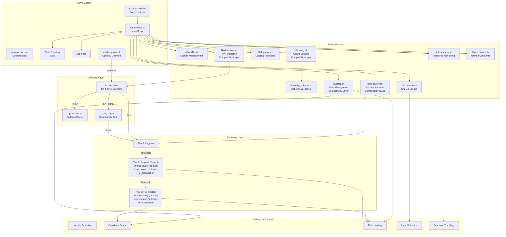
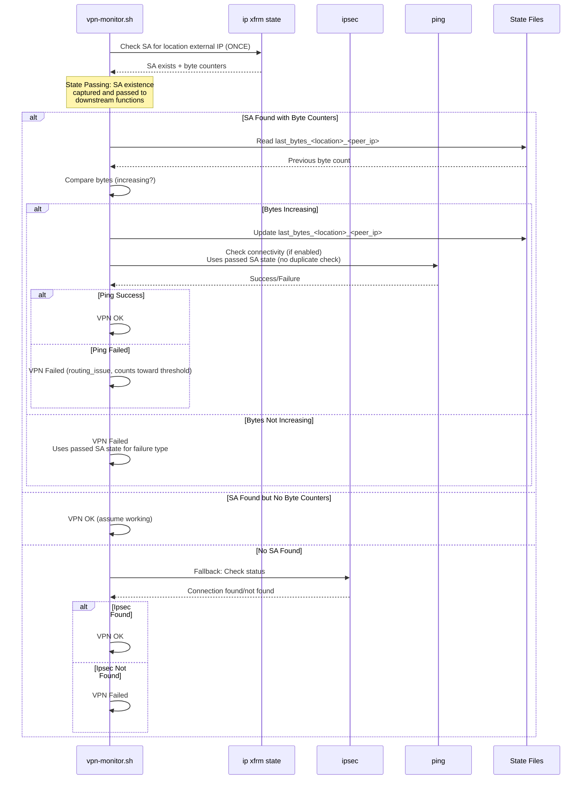
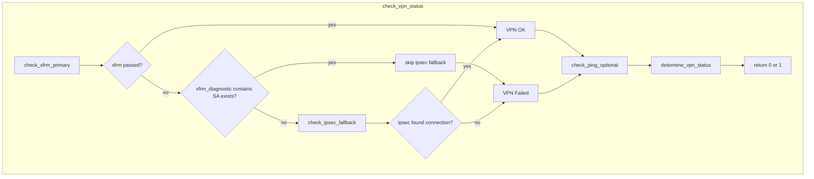
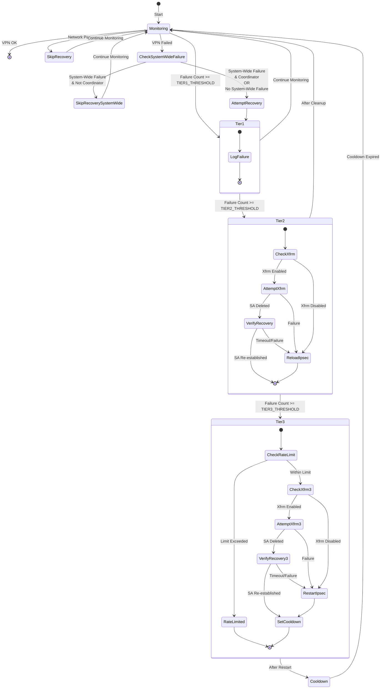
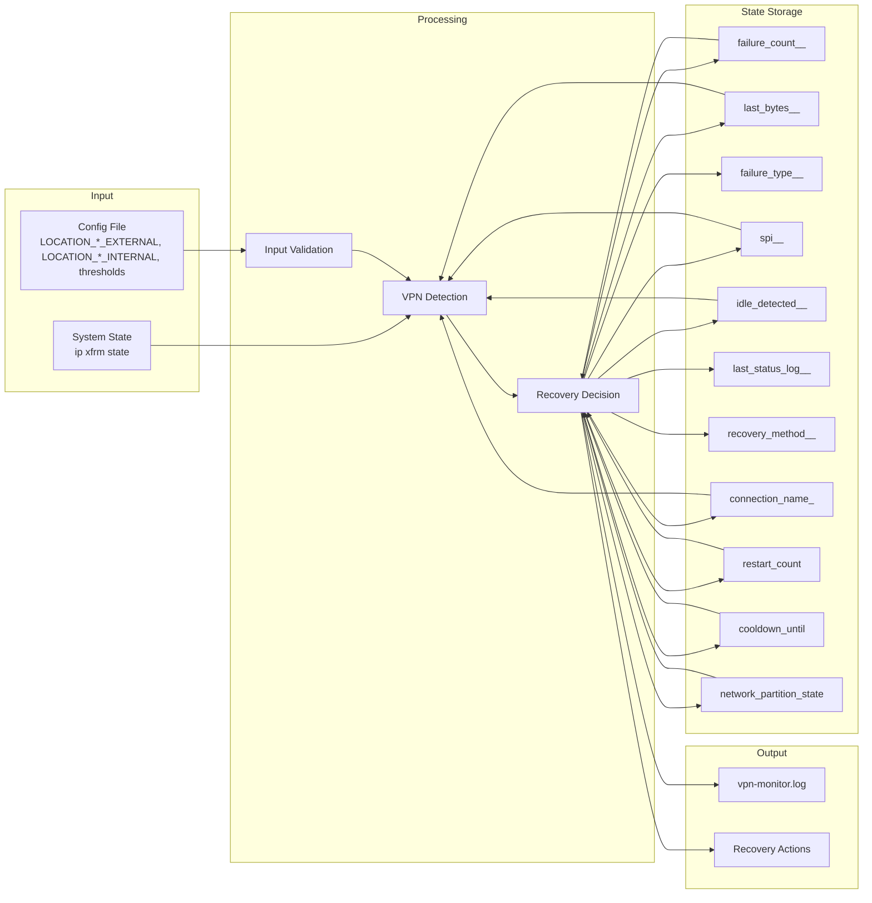
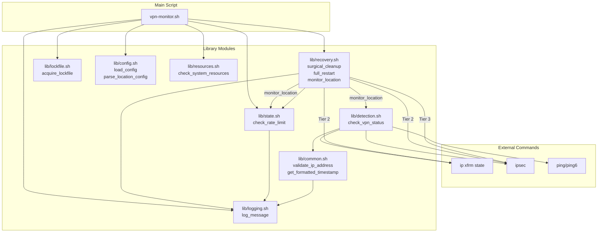

# Architecture Documentation

This document describes the architecture and design of the UDM VPN Monitor system.

## System Overview

```
┌─────────────────────────────────────────────────────────────────┐
│                    UniFi Dream Machine (UDM)                    │
│                                                                 │
│  ┌──────────────────────────────────────────────────────────┐  │
│  │              Cron Scheduler (every 1 min)                │  │
│  └────────────────────┬─────────────────────────────────────┘  │
│                       │                                         │
│                       ▼                                         │
│  ┌──────────────────────────────────────────────────────────┐  │
│  │              vpn-monitor.sh (Main Script)                 │  │
│  │  ┌────────────────────────────────────────────────────┐  │  │
│  │  │  lib/lockfile.sh - Lockfile Protection            │  │  │
│  │  │  (flock or atomic file)                           │  │  │
│  │  └────────────────────────────────────────────────────┘  │  │
│  │                       │                                     │  │
│  │                       ▼                                     │  │
│  │  ┌────────────────────────────────────────────────────┐  │  │
│  │  │  lib/config.sh - Configuration Loading            │  │  │
│  │  │  lib/config_schema.sh - Schema Validation        │  │  │
│  │  └────────────────────────────────────────────────────┘  │  │
│  │                       │                                     │  │
│  │                       ▼                                     │  │
│  │  ┌────────────────────────────────────────────────────┐  │  │
│  │  │  lib/state.sh - State Initialization              │  │  │
│  │  │  lib/logging.sh - Logging Functions              │  │  │
│  │  └────────────────────────────────────────────────────┘  │  │
│  │                       │                                     │  │
│  │                       ▼                                     │  │
│  │  ┌────────────────────────────────────────────────────┐  │  │
│  │  │  lib/resources.sh - Resource Monitoring           │  │  │
│  │  │  (CPU, RAM, disk space throttling)               │  │  │
│  │  └────────────────────────────────────────────────────┘  │  │
│  │                       │                                     │  │
│  │                       ▼                                     │  │
│  │  ┌────────────────────────────────────────────────────┐  │  │
│  │  │  For Each Location:                               │  │  │
│  │  │  lib/recovery.sh - monitor_location()             │  │  │
│  │  │  ┌──────────────────────────────────────────────┐ │  │  │
│  │  │  │  lib/detection.sh - VPN Status Check        │ │  │  │
│  │  │  └──────────────────────────────────────────────┘ │  │  │
│  │  │  ┌──────────────────────────────────────────────┐ │  │  │
│  │  │  │  lib/recovery.sh - Recovery Actions         │ │  │  │
│  │  │  │  (surgical_cleanup, full_restart)          │ │  │  │
│  │  │  └──────────────────────────────────────────────┘ │  │  │
│  │  └────────────────────────────────────────────────────┘  │  │
│  └──────────────────────────────────────────────────────────┘  │
│                                                                 │
│  ┌──────────────────────────────────────────────────────────┐  │
│  │  Optional: VPN Keepalive Daemon                           │  │
│  │  ┌────────────────────────────────────────────────────┐  │  │
│  │  │  vpn-keepalive.sh (systemd service)              │  │  │
│  │  │  Sends periodic ping traffic through VPN tunnels │  │  │
│  │  │  Prevents idle timeout, keeps tunnels alive     │  │  │
│  │  └────────────────────────────────────────────────────┘  │  │
│  └──────────────────────────────────────────────────────────┘  │
│                                                                 │
│  ┌──────────────────────────────────────────────────────────┐  │
│  │  State Files (${SCRIPT_DIR}/state/)                       │  │
│  │  • failure_count_<location>_<peer_ip>  # Per-location │  │
│  │  • last_bytes_<location>_<peer_ip>  # Per-location     │  │
│  │  • failure_type_<location>_<peer_ip>  # Per-location   │  │
│  │  • spi_<location>_<peer_ip>  # Per-location            │  │
│  │  • idle_detected_<location>_<peer_ip>  # Per-location   │  │
│  │  • last_status_log_<location>_<peer_ip>  # Per-location │  │
│  │  • recovery_method_<location>_<peer_ip>  # Per-location│  │
│  │  • connection_name_<peer_ip>  # Per-peer (no location)│  │
│  │  • cooldown_until  # System-wide                        │  │
│  │  • restart_count  # System-wide                          │  │
│  │  • network_partition_state  # System-wide               │  │
│  │  • system_wide_failure_state  # System-wide            │  │
│  │  • system_wide_failure_timestamp  # System-wide        │  │
│  │  • system_wide_failure_coordinator  # System-wide     │  │
│  │  • vpn-monitor.lock  # System-wide                      │  │
│  │  • .cron_checked  # System-wide                        │  │
│  │  • .last_run_timestamp  # System-wide                  │  │
│  └──────────────────────────────────────────────────────────┘  │
│                                                                 │
│  ┌──────────────────────────────────────────────────────────┐  │
│  │  Log Files (${SCRIPT_DIR}/logs/)                        │  │
│  │  • vpn-monitor.log                                       │  │
│  │  • vpn-keepalive.log (if keepalive daemon enabled)      │  │
│  └──────────────────────────────────────────────────────────┘  │
└─────────────────────────────────────────────────────────────────┘
```

## Component Architecture



## Execution Flow

```mermaid
flowchart TD
    Start([Cron Trigger]) --> CreateDirs[Create Directories<br/>state/, logs/]
    CreateDirs --> InitLogFile[Initialize Log File<br/>Test Write Capability]
    InitLogFile --> LoadConfig[Load Configuration]
    LoadConfig --> ValidateConfig[Validate Configuration<br/>Schema & Location Config]
    ValidateConfig --> LockCheck{Lockfile<br/>Available?}
    LockCheck -->|No| Exit1([Exit: Another<br/>instance running])
    LockCheck -->|Yes| AcquireLock[Acquire Lockfile]
    AcquireLock --> InitMonitor[Initialize Monitor<br/>Parse Args, Log Start, Init State]
    InitMonitor --> ValidateState[Validate State Files<br/>Format Validation]
    ValidateState --> ResourceCheck[Check System Resources<br/>CPU, RAM, Disk]
    ResourceCheck -->|Constrained| Exit6([Exit: Resources<br/>Constrained])
    ResourceCheck -->|OK| NetworkPartitionCheck{Network<br/>Partition<br/>Check<br/>Enabled?}
    NetworkPartitionCheck -->|Yes| CheckPartition[Check Network<br/>Partition Status]
    NetworkPartitionCheck -->|No| CooldownCheck{In<br/>Cooldown?}
    CheckPartition -->|Partitioned| UpdatePartitionState[Update Partition State<br/>Continue Execution]
    CheckPartition -->|Healthy| UpdatePartitionState
    UpdatePartitionState --> CooldownCheck{In<br/>Cooldown?}
    CooldownCheck -->|Yes| Exit2([Exit: In<br/>cooldown period])
    CooldownCheck -->|No| CronCheck[Check Cron<br/>Persistence<br/>Once Per Run]
    CronCheck --> ForEachLocation[For Each Location]

    ForEachLocation --> CheckVPN[check_vpn_status]

    CheckVPN --> XfrmCheck{ip xfrm state<br/>SA Found?}
    XfrmCheck -->|Yes| ByteCheck{Bytes<br/>Increasing?}
    XfrmCheck -->|No| IpsecCheck{ipsec status<br/>Found?}

    ByteCheck -->|Yes| PingCheck{Enable<br/>Ping Check?}
    ByteCheck -->|No| VPNFail[VPN Failed]

    PingCheck -->|Yes| PingTest{ping<br/>Success?}
    PingCheck -->|No| VPNOK[VPN OK]
    PingTest -->|Yes| VPNOK
    PingTest -->|No| VPNFail[VPN Failed]

    IpsecCheck -->|Yes| VPNOK
    IpsecCheck -->|No| VPNFail

    VPNOK --> ResetCounter[Reset Failure Counter]
    VPNFail --> NetworkPartitionCheck2{Network<br/>Partitioned?}
    NetworkPartitionCheck2 -->|Yes| SkipRecovery[Skip Recovery<br/>Actions]
    NetworkPartitionCheck2 -->|No| IncrementCounter[Increment Failure Counter]

    SkipRecovery --> NextLocation
    IncrementCounter --> TierCheck{Failure<br/>Count?}
    TierCheck -->|>= TIER1| Tier1[Log Failure]
    TierCheck -->|>= TIER2| Tier2[Surgical Cleanup]
    TierCheck -->|>= TIER3| RateLimitCheck{Rate Limit<br/>OK?}

    Tier1 --> NextLocation
    Tier2 --> NextLocation

    RateLimitCheck -->|No| Exit4([Exit: Rate<br/>Limited])
    RateLimitCheck -->|Yes| Tier3[Full Restart]
    Tier3 --> RecordRestart[Record Restart]
    RecordRestart --> SetCooldown[Set Cooldown Period]

    ResetCounter --> NextLocation
    SetCooldown --> NextLocation
    Exit4 --> NextLocation

    NextLocation --> MoreLocations{More<br/>Locations?}
    MoreLocations -->|Yes| ForEachLocation
    MoreLocations -->|No| SystemWideFailureCheck{System-Wide<br/>Failure<br/>Detection<br/>Enabled?}
    SystemWideFailureCheck -->|Yes| CheckSystemWideFailure[Check System-Wide<br/>Failure Status<br/>Compare Failure Counts<br/>to Threshold]
    SystemWideFailureCheck -->|No| ReleaseLock[Release Lockfile]
    CheckSystemWideFailure -->|System-Wide<br/>Failure<br/>Detected| SetSystemWideFailureState[Set System-Wide<br/>Failure State<br/>Designate Coordinator]
    CheckSystemWideFailure -->|No System-Wide<br/>Failure| ClearSystemWideFailureState{Previous<br/>System-Wide<br/>Failure?}
    ClearSystemWideFailureState -->|Yes| ClearSystemWideState[Clear System-Wide<br/>Failure State<br/>Clear Coordinator]
    ClearSystemWideFailureState -->|No| ReleaseLock
    SetSystemWideFailureState --> ReleaseLock
    ClearSystemWideState --> ReleaseLock
    ReleaseLock --> End([End])

    Exit1 --> End
    Exit2 --> End
    Exit6 --> End
```



**Note**:
- **Execution Order**: The actual execution flow includes more steps than shown in simplified form above. Full order: Directory creation (state, logs) → Log file initialization → Config loading → Config validation → Lockfile acquisition → Initialize monitor (parse args, log start, init state) → State validation → Resource check → Network partition check → Cooldown check → Cron persistence check → Location processing.
- **Sub-minute Execution (Optional)**: When `ENABLE_MONITOR_WRAPPER=1` (default), cron runs `vpn-monitor-wrapper.sh` instead of `vpn-monitor.sh` directly. The wrapper loops with `MONITOR_INTERVAL`-second sleeps (default: 20s), running checks at :00, :20, :40 within each minute. Cron resurrects the wrapper every minute if it exits. See `vpn-monitor-wrapper.sh` and config options `ENABLE_MONITOR_WRAPPER`, `MONITOR_INTERVAL`.

- **State Validation**: State files are validated for format correctness (integer, timestamp, timestamp_list) early in execution (after state initialization). Corrupted files are automatically detected, backed up, and recovered with safe defaults. This validation step ensures state file integrity before proceeding.

- **Resource Monitoring**: Checks CPU, RAM, and disk space usage early in the execution flow (after state validation). If system resources are severely constrained, the script exits early to avoid adding load to an already stressed system. This throttling mechanism prevents the monitor from contributing to system overload.

- **Network Partition Check**: (if enabled via `ENABLE_NETWORK_PARTITION_CHECK`) occurs before cooldown check to ensure partition detection works even during cooldown periods. This timing is intentional - if the network is partitioned, VPN checks should be skipped regardless of cooldown status. When network is partitioned, the script updates partition state and continues execution (does not exit early). Recovery actions later check partition state and skip recovery if network is partitioned, allowing VPN checks to proceed but preventing unnecessary recovery actions.

- **Cron Persistence Check**: Performed once per run (tracked via `.cron_checked` file) after cooldown check. Detects if cron jobs were removed during system upgrades (common after UniFi OS updates). Logs warnings but doesn't fail execution - this is a diagnostic check to help users detect configuration loss.

- **Ping Check** (enabled by default): When `ENABLE_PING_CHECK=1`, ping runs for every location (target = internal IP(s) or external IP). Ping failure is treated as VPN failed (routing_issue) and counts toward the recovery threshold; the diagram’s "Ping Success?" → No leads to VPN Failed.

- **System-Wide Failure Detection**: (if enabled via `ENABLE_SYSTEM_WIDE_FAILURE_DETECTION`) occurs after all locations are checked but before recovery attempts. The system checks all locations' VPN status (read-only, doesn't update state) and compares failure count to configured threshold. If threshold exceeded, system-wide failure state is set and recovery coordination is enabled. Only the designated coordinator location attempts recovery during system-wide failures, preventing cascades and rate limiting issues. System-wide failure state is cleared when failures drop below threshold. This detection happens in `process_locations()` before individual location recovery attempts in `monitor_location()`. See the "System-Wide Failure Detection" section below for detailed documentation.

## System-Wide Failure Detection

System-wide failure detection identifies infrastructure-level issues when multiple VPN locations fail simultaneously. This feature prevents recovery cascades and rate limiting by coordinating recovery attempts during infrastructure outages.

### Overview

When all (or a configured majority) of VPN locations fail at the same time, this typically indicates an infrastructure-level problem (ISP outage, router issues, network-wide connectivity problems) rather than individual VPN tunnel failures. In such scenarios, attempting recovery for each location independently would:
- Create recovery cascades (all locations attempting recovery simultaneously)
- Trigger rate limiting mechanisms
- Waste system resources (recovery cannot succeed during infrastructure outages)
- Generate excessive log noise

System-wide failure detection addresses these issues by:
1. **Detecting** when multiple locations fail simultaneously
2. **Coordinating** recovery so only one location (the coordinator) attempts recovery
3. **Preventing** cascades and rate limiting during infrastructure outages
4. **Resuming** normal per-location recovery when infrastructure is restored

### Detection Mechanism

System-wide failure detection occurs in `process_locations()` after all locations have been checked but before individual recovery attempts:

1. **Failure Status Collection**: The system collects failure status for all locations from existing state (failure counts from previous cycle)
   - Uses existing failure counts rather than re-checking VPNs (avoids double work)
   - One-cycle delay is acceptable for coordination purposes
   - Conservative approach: better to coordinate unnecessarily than miss a real system-wide failure

2. **Threshold Comparison**: Compares failed location percentage to configured threshold
   - Default threshold: 100% (all locations must fail)
   - Configurable via `SYSTEM_WIDE_FAILURE_THRESHOLD` (range: 50-100%)
   - Requires at least 2 locations to detect system-wide failure (single location failure is not "system-wide")

3. **State Management**: Updates system-wide failure state and timestamp
   - Sets system-wide failure state to 1 when threshold exceeded
   - Records timestamp when failure first detected
   - Clears state when failures drop below threshold

### Recovery Coordination

When system-wide failure is detected, recovery is coordinated using a "first location wins" approach:

1. **Coordinator Designation**: First location to check during system-wide failure becomes the coordinator
   - Uses atomic file write (`set -C` noclobber mode) to safely designate coordinator
   - Coordinator designation stored in `system_wide_failure_coordinator` state file
   - Coordinator persists until system-wide failure is resolved

2. **Recovery Attempts**: Only the coordinator location attempts recovery
   - Coordinator attempts recovery normally (Tier 1, 2, 3 as appropriate)
   - Non-coordinator locations skip recovery actions but continue monitoring
   - Recovery coordination checked in `monitor_location()` before Tier 2/3 recovery attempts

3. **Coordination Check**: Each location checks `should_location_attempt_recovery()` before recovery
   - Returns 0 (attempt recovery) if:
     - System-wide failure detection is disabled, OR
     - No system-wide failure detected, OR
     - Current location is the coordinator
   - Returns 1 (skip recovery) if:
     - System-wide failure detected AND current location is not coordinator

4. **Automatic Cleanup**: Coordinator is automatically cleared when system-wide failure is resolved
   - When failures drop below threshold, system-wide failure state is cleared
   - Coordinator file is automatically removed
   - Per-location recovery resumes normally

### Configuration

System-wide failure detection is controlled by three configuration options:

- **`ENABLE_SYSTEM_WIDE_FAILURE_DETECTION`** (default: 1, enabled)
  - Enable/disable system-wide failure detection
  - When disabled, all locations attempt recovery independently

- **`SYSTEM_WIDE_FAILURE_THRESHOLD`** (default: 100, range: 50-100)
  - Percentage of locations that must fail to trigger detection
  - 100 = all locations must fail (default)
  - 80 = 80% of locations must fail
  - Lower thresholds detect system-wide failures earlier but may trigger on partial outages

- **`COORDINATE_SYSTEM_WIDE_RECOVERY`** (default: 1, enabled)
  - Enable/disable recovery coordination during system-wide failures
  - When disabled, all locations attempt recovery independently even during system-wide failures
  - When enabled, only coordinator attempts recovery during system-wide failures

### State Files

System-wide failure detection uses three system-wide state files (not per-peer, since infrastructure issues affect all peers):

- **`system_wide_failure_state`**: System-wide failure status (0 = no failure, 1 = failure detected)
- **`system_wide_failure_timestamp`**: Unix timestamp when failure was first detected
- **`system_wide_failure_coordinator`**: Location name of recovery coordinator

See the "State Management" section above for detailed state file documentation.

### Integration Points

1. **Detection** (`vpn-monitor.sh` → `process_locations()`):
   - Runs after all locations are checked
   - Collects failure status from existing state
   - Updates system-wide failure state and timestamp
   - Logs system-wide failure events

2. **Recovery Actions** (`lib/recovery/recovery_orchestration.sh` → `monitor_location()`):
   - Checks `should_location_attempt_recovery()` before Tier 2/3 recovery attempts
   - Coordinator attempts recovery normally
   - Non-coordinator locations skip recovery actions
   - Logs informative messages about skipped recovery

### Design Rationale

The "first location wins" coordination approach was chosen over alternatives for:

- **Simplicity**: No complex leader election or consensus algorithms needed
- **Effectiveness**: Handles common case (infrastructure outages) very well
- **Minimal Overhead**: Atomic file writes are fast and reliable
- **Acceptable Race Condition**: If two locations check simultaneously, worst case is both attempt recovery (still better than all locations)
- **No Additional Infrastructure**: Works with existing state file system

See ADR-0031 for detailed design rationale and alternative approaches considered.

### Related Documentation

- **ADR-0031**: System-Wide Failure Detection and Coordination (detailed design rationale)
- **Code Diagram**: `docs/code-diagrams/system-wide-failure-flow.md` (function flow diagrams)
- **Implementation**: `lib/detection/system_wide_failure.sh` (detection and coordination functions)
- **Integration**: `vpn-monitor.sh` → `process_locations()` (detection integration)
- **Recovery Integration**: `lib/recovery/recovery_orchestration.sh` → `monitor_location()` (coordination integration)

## Detection Method Flow



**Note**: The detection flow uses a state passing pattern (see Design Decision #12) where SA existence is checked once via `ip xfrm state` and the result is passed to downstream functions (`check_ping_optional()`, `detect_failure_type()`). This optimization reduces system calls by 66-75% and ensures consistent state across all detection functions.

### Ping Check Behavior

Ping check is **enabled by default** (`ENABLE_PING_CHECK=1`). When enabled:

- **Ping always runs** for each location: target is the location’s internal IP(s) if configured, otherwise the external IP. A warning is logged at config validation if `LOCAL_UDM_IP` or location internal/external IPs are not set.
- **Ping failure is treated as VPN failed**: failure type is `routing_issue`, the VPN is marked failed, and the run counts toward the failure threshold (recovery tiers).

**Scenario 1: SA Exists But Ping Fails**
- **Behavior**: VPN is marked as **FAILED** (failure type `routing_issue`), a **WARNING** is logged, and the failure counts toward the recovery threshold.
- **Reasoning**: The SA exists but ping failure indicates the tunnel is not reliably routing traffic; the run is treated as a failure so repeated ping failures can trigger recovery.
- **Impact**: Same as other failures: failure counter increments and tier logic applies (Tier 1 log, Tier 2 surgical cleanup, Tier 3 full restart when thresholds are reached).

**Scenario 2: SA Doesn't Exist But Ping Succeeds**
- **Behavior**: VPN is marked as **FAILED** (no SA), but a **WARNING** is logged that connectivity exists via an alternative route.
- **Reasoning**: No Security Association exists, so the VPN tunnel is down. Ping succeeds via another path (e.g. direct internet, other VPN).
- **Impact**: Normal failure handling; the warning helps distinguish “no connectivity” from “connectivity exists but not through this tunnel”.

**Design rationale**: When ping check is enabled, it is a **hard failure condition**: ping failure causes the VPN to be considered failed for that run and contributes to the threshold for recovery actions. Configure `LOCAL_UDM_IP` and per-location internal (or external) IPs for reliable ping checks.

### VPN status check: xfrm primary and ipsec fallback

`check_vpn_status()` (in `lib/detection/failure_analysis.sh`) tries xfrm first, then optionally ipsec status. Whether ipsec fallback runs depends on **why** xfrm failed, not on ping:

- **xfrm passes** → VPN OK; no fallback.
- **xfrm fails, diagnostic does not contain "SA exists"** (no SA, or xfrm command error) → **ipsec status runs**. If ipsec finds the connection, VPN is marked OK.
- **xfrm fails, diagnostic contains "SA exists"** (SA found but validation failed: e.g. ping timeout, bytes not increasing, bytes decreased) → **ipsec fallback is skipped**; result stays failed. This avoids ipsec status (which can still show "established" when the tunnel is broken) from resetting the failure count and blocking recovery.



**Summary**

| xfrm result | xfrm diagnostic      | ipsec fallback runs? | VPN result if ipsec would pass |
|-------------|-----------------------|----------------------|----------------------------------|
| Pass        | —                     | No                   | OK                               |
| Fail        | No SA / xfrm error    | **Yes**              | OK (if ipsec finds connection)   |
| Fail        | "SA exists" (e.g. ping failed, bytes not increasing) | **No**  | Failed (stays failed)            |

So: **xfrm fails but ping passes** — ipsec status runs only when the failure was **no SA** (or xfrm error). When the failure is "SA exists" (validation failed), we never run ipsec; in those paths ping has already been used inside xfrm and did not pass (otherwise xfrm would have passed).

## Recovery Tier Flow



**Note**: Network partition check also occurs after VPN check fails. When a VPN failure is detected, the failure counter is incremented first (to track the failure even if recovery is skipped), then network partition state is checked. If network is partitioned when a VPN failure is detected, recovery actions are skipped to avoid unnecessary disruption, but the failure count is still incremented for tracking purposes.

**System-Wide Failure Coordination**: When system-wide failure is detected (all or majority of locations failing simultaneously), recovery is coordinated to prevent cascades and rate limiting. Before attempting Tier 2 or Tier 3 recovery actions, the system checks if system-wide failure is active and if the current location is the designated coordinator. Only the coordinator location attempts recovery during system-wide failures; non-coordinator locations skip recovery actions but continue monitoring. This coordination prevents multiple simultaneous recovery attempts that could overwhelm the system or trigger rate limiting during infrastructure-level outages.

## Data Flow



## State Management

The system uses file-based state management to track VPN health, failure counts, recovery actions, and system state across execution cycles. All state is persisted relative to the script location (`${SCRIPT_DIR}/`) to survive reboots.

**Note**: Paths are relative to the script location, not hardcoded absolute paths. The script sets `SCRIPT_DIR` to its own directory location. When installed to `/data/vpn-monitor`, `SCRIPT_DIR` resolves to `/data/vpn-monitor`, so state files are created at `/data/vpn-monitor/state/` and `/data/vpn-monitor/logs/`. This design allows the script to work in dev mode or if installed to a different location.

### State Files Overview

State files are organized into two categories:

**Per-Location State Files** (tracked independently for each VPN location):
- `${STATE_DIR}/failure_count_<location>_<peer_ip>`: Consecutive failure count per location (sanitized location name and IP in filename).
- `${STATE_DIR}/last_bytes_<location>_<peer_ip>`: Last known byte counter value per location (sanitized location name and IP in filename)
- `${STATE_DIR}/failure_type_<location>_<peer_ip>`: Tracks failure type for diagnostic purposes (cleared on recovery)
- `${STATE_DIR}/spi_<location>_<peer_ip>`: Stores SPI (Security Parameter Index) for location connection tracking
- `${STATE_DIR}/idle_detected_<location>_<peer_ip>`: Tracks idle detection state for the location
- `${STATE_DIR}/last_status_log_<location>_<peer_ip>`: Timestamp of last status log entry for the location
- `${STATE_DIR}/recovery_method_<location>_<peer_ip>`: Tracks recovery method used when recovery was attempted (cleared after restoration is logged)

**Per-Peer State Files** (tracked per peer IP, not per location):
- `${STATE_DIR}/connection_name_<peer_ip>`: Caches IPsec connection name discovered from `ipsec status` output (per-peer only, no location). Used for enhanced logging to show connection names in log messages. Format: `connection_name_<sanitized_peer_ip>` (e.g., `connection_name_203_0_113_1`)

**System-Wide State Files** (shared across all peers):
- `${STATE_DIR}/cooldown_until`: Cooldown expiration timestamp (prevents immediate re-restarts)
- `${STATE_DIR}/restart_count`: Unix timestamps of Tier 3 recovery actions (one timestamp per line, for rate limiting) - see [Rate Limiting](#rate-limiting-staterestart_count) section below for details
- `${STATE_DIR}/network_partition_state`: Network partition status (0 = healthy, 1 = partitioned) - used to detect network connectivity issues that affect all peers
- `${STATE_DIR}/network_partition_dns_success_count`: DNS resolution check success counter (for hourly statistics summary)
- `${STATE_DIR}/network_partition_dns_fail_count`: DNS resolution check failure counter (for hourly statistics summary)
- `${STATE_DIR}/network_partition_route_success_count`: Default route check success counter (for hourly statistics summary)
- `${STATE_DIR}/network_partition_route_fail_count`: Default route check failure counter (for hourly statistics summary)
- `${STATE_DIR}/network_partition_interface_success_count`: Interface state check success counter (for hourly statistics summary)
- `${STATE_DIR}/network_partition_interface_fail_count`: Interface state check failure counter (for hourly statistics summary)
- `${STATE_DIR}/network_partition_summary_last_time`: Timestamp of last hourly statistics summary (for throttling summary logging)
- `${STATE_DIR}/resource_cpu_check_success_count`: CPU check success counter (resource monitoring statistics)
- `${STATE_DIR}/resource_cpu_check_fail_count`: CPU check failure counter (resource monitoring statistics)
- `${STATE_DIR}/resource_ram_check_success_count`: RAM check success counter (resource monitoring statistics)
- `${STATE_DIR}/resource_ram_check_fail_count`: RAM check failure counter (resource monitoring statistics)
- `${STATE_DIR}/resource_disk_check_success_count`: Disk check success counter (resource monitoring statistics)
- `${STATE_DIR}/resource_disk_check_fail_count`: Disk check failure counter (resource monitoring statistics)
- `${STATE_DIR}/resource_cpu_constrained_count`: CPU constrained event counter (resource monitoring statistics)
- `${STATE_DIR}/resource_ram_constrained_count`: RAM constrained event counter (resource monitoring statistics)
- `${STATE_DIR}/resource_disk_critical_count`: Disk critical event counter (resource monitoring statistics)
- `${STATE_DIR}/resource_monitoring_summary_last_time`: Timestamp of last resource monitoring summary (for hourly summary logging)
- `${STATE_DIR}/vpn-monitor.lock`: Lockfile for execution control (format: `timestamp:pid` for timeout detection)
- `${STATE_DIR}/.cron_checked`: Flag file to prevent repeated cron persistence checks
- `${STATE_DIR}/.last_run_timestamp`: Timestamp file to track last script execution (for startup grace period detection)

**Note**: `STATE_DIR` defaults to `${SCRIPT_DIR}/state` and `LOGS_DIR` defaults to `${SCRIPT_DIR}/logs`. These can be overridden via configuration. When installed to `/data/vpn-monitor`, these resolve to `/data/vpn-monitor/state` and `/data/vpn-monitor/logs` respectively.

### Per-Location State Tracking

The monitor tracks state independently for each configured location, enabling independent monitoring and recovery actions for multiple VPN tunnels. This is essential when monitoring multiple Site-to-Site VPN connections, as failures in one location should not affect the monitoring or recovery of other locations.

**Location-Based Configuration**:
VPNs are configured using location-based variables:
- `LOCATION_<NAME>_EXTERNAL`: External/public IP address of the remote VPN gateway
- `LOCATION_<NAME>_INTERNAL`: Internal/private IP address(es) for ping checks (optional, space-separated). When ping is enabled but not set, external IP is used and a config warning is logged.
- Location names are automatically extracted from variable names (text between `LOCATION_` and `_EXTERNAL`)
- For locations with multiple internal IPs, VPN is considered healthy if ≥30% respond to pings

**File Naming Convention**:
All per-location state files use sanitized location names and peer IP addresses in their filenames:
- Location names are sanitized: invalid characters replaced with underscores, max 64 chars
- IP addresses are sanitized: dots and colons replaced with underscores (e.g., `192.168.1.1` becomes `192_168_1_1`)
- Format: `<key>_<location>_<peer_ip>` (e.g., `failure_count_NYC_203_0_113_1`)
- This ensures safe filenames while maintaining uniqueness per location

**Per-Location State Files**:

1. **Failure Counters** (`state/failure_count_<location>_<peer_ip>`)
   - **Purpose**: Tracks consecutive failure count for each location independently
   - **Creation**: Created on-demand when a location first fails
   - **Usage**: Used to determine which recovery tier to trigger (Tier 1, 2, or 3)
   - **Independence**: Each location has its own counter. For example:
     - Location NYC (`203.0.113.1`) failing 3 times → triggers Tier 2 recovery for NYC
     - Location DC (`198.51.100.1`) failing 2 times → triggers Tier 1 logging for DC
     - These are tracked completely independently
   - **Reset**: Counter resets to 0 when VPN check succeeds for that location
   - **Location**: Stored in `${STATE_DIR}` directory (defaults to `${SCRIPT_DIR}/state`, typically `/data/vpn-monitor/state/` when installed)

2. **Byte Counters** (`last_bytes_<location>_<peer_ip>`)
   - **Purpose**: Stores the last known byte counter value from `ip xfrm state` for each location
   - **Creation**: Created on-demand when byte counters are first read for a location
   - **Usage**: Used to detect if byte counters are increasing (indicating active traffic flow)
   - **Independence**: Each location has its own byte counter file, allowing independent traffic flow detection
   - **Update**: Updated each time a successful check reads increasing byte counters
   - **Location**: Stored in `${STATE_DIR}` directory (defaults to `${SCRIPT_DIR}/state`, typically `/data/vpn-monitor/state/` when installed)

3. **Failure Type** (`failure_type_<location>_<peer_ip>`)
   - **Purpose**: Tracks the type of failure for diagnostic purposes (e.g., "tunnel_down", "routing_issue")
   - **Creation**: Created on-demand when failure type is determined during VPN check failure
   - **Usage**: Used to provide more detailed failure information in logs (e.g., "VPN check failed (tunnel down)" vs "VPN check failed (routing issue)")
   - **Independence**: Each location has its own failure type file
   - **Clear**: Automatically cleared (deleted) when VPN recovers after failures
   - **Location**: Stored in `${STATE_DIR}` directory

4. **SPI (Security Parameter Index)** (`spi_<location>_<peer_ip>`)
   - **Purpose**: Stores the SPI value extracted from `ip xfrm state` output for each location
   - **Creation**: Created on-demand when SPI is first extracted from xfrm state
   - **Usage**: Used to detect SA (Security Association) rekeys - when SPI changes, it indicates the SA was rekeyed and byte counters may have been reset
   - **Format**: Stored in normalized hex format (0x12345678) for consistent comparison. SPI values are normalized from either hex or decimal format to 8-digit lowercase hex (0x...) to prevent false rekey detection when format differs between reads
   - **Independence**: Each location has its own SPI file, allowing independent SA rekey detection
   - **Update**: Updated when SPI is read from xfrm state (normalized to hex format)
   - **Location**: Stored in `${STATE_DIR}` directory

5. **Idle Detection** (`idle_detected_<location>_<peer_ip>`)
   - **Purpose**: Tracks when a tunnel is detected as idle (bytes not increasing but tunnel is healthy)
   - **Creation**: Created on-demand when idle state is detected
   - **Usage**: Set to "1" when tunnel is idle but healthy (SA exists, bytes not increasing, but ping check succeeds). Cleared when traffic resumes (bytes start increasing again) or when SA rekeys
   - **Independence**: Each location has its own idle detection state
   - **Clear**: Automatically cleared when traffic resumes or SA rekeys
   - **Location**: Stored in `${STATE_DIR}` directory

6. **Last Status Log** (`last_status_log_<location>_<peer_ip>`)
   - **Purpose**: Stores the Unix timestamp of the last periodic "VPN OK" status log entry for each location
   - **Creation**: Created on-demand when first periodic status log is written
   - **Usage**: Used to throttle periodic status logging - prevents log spam by only logging "VPN OK" messages at configured intervals (default: every 5 minutes via `STATUS_LOG_INTERVAL_SECONDS`)
   - **Independence**: Each location has its own last status log timestamp, allowing independent throttling per location
   - **Update**: Updated each time a periodic status log entry is written
   - **Location**: Stored in `${STATE_DIR}` directory

7. **Recovery Method** (`recovery_method_<location>_<peer_ip>`)
   - **Purpose**: Tracks which recovery method was used when recovery was attempted (e.g., "xfrm", "ipsec_reload", "ipsec_restart")
   - **Creation**: Created on-demand when a recovery action is attempted (Tier 2 or Tier 3)
   - **Usage**: Used to include recovery method information in "VPN restored" log messages, providing visibility into which recovery method successfully restored the VPN tunnel
   - **Independence**: Each location has its own recovery method tracking, allowing correlation between recovery attempts and restoration events per location
   - **Update**: Updated when recovery is attempted:
     - Stored before recovery action is executed
     - Updated if fallback recovery method is used (e.g., xfrm fails, falls back to ipsec_reload)
     - Cleared after VPN restoration is logged to prevent stale information
   - **Values**:
     - `"xfrm"`: xfrm-based per-connection recovery was used
     - `"ipsec_reload"`: ipsec reload recovery was used
     - `"ipsec_restart"`: ipsec restart recovery was used
   - **Display**: Recovery method is formatted for display in log messages:
     - `"xfrm"` → `"xfrm-based recovery"`
     - `"ipsec_reload"` → `"ipsec reload"`
     - `"ipsec_restart"` → `"ipsec restart"`
   - **Location**: Stored in `${STATE_DIR}` directory
  - **Example Log Messages**:
    - `"VPN restored for location NYC (203.0.113.1) after 3 failures (recovery method: xfrm-based recovery)"`
    - `"VPN restored for location NYC (203.0.113.1) (recovery method: ipsec reload)"`

**Recovery Type Distinction**:
The log analysis script (`analyze-logs.sh`) distinguishes between two types of recoveries based on log message patterns:

1. **App-Managed Recoveries** (with intervention):
   - **Identification**: Log messages containing "recovery method" or "VPN restored" indicate that a recovery action (Tier 2 or Tier 3) was attempted
   - **Pattern**: 
     - `"VPN restored for LOCATION (IP) after N failures (recovery method: METHOD)"` - Explicit recovery method
     - `"VPN restored for LOCATION (IP) (recovery method: METHOD)"` - Recovery method without failure count
     - `"VPN restored for LOCATION (IP) after N failures"` - "restored" terminology indicates intervention
     - `"VPN restored for LOCATION (IP)"` - "restored" terminology indicates intervention
   - **Meaning**: The system took action to restore the VPN tunnel (xfrm recovery, ipsec reload, or ipsec restart)
   - **Statistics**: Tracked separately to evaluate effectiveness of recovery actions and intervention needs
   - **Example**: `"VPN restored for NYC (203.0.113.1) after 3 failures (recovery method: xfrm-based recovery)"`

2. **Self-Healed Recoveries** (no intervention):
   - **Identification**: Log messages containing "VPN recovered" without "recovery method" indicate natural recovery
   - **Pattern**: 
     - `"VPN recovered for LOCATION (IP) after N failures"` - "recovered" without recovery method
     - `"VPN recovered for LOCATION (IP)"` - "recovered" without recovery method or failure count
   - **Meaning**: The VPN tunnel recovered on its own without requiring intervention (e.g., SA rekey, network recovery, transient issues)
   - **Statistics**: Tracked separately to evaluate VPN stability and natural recovery capabilities
   - **Example**: `"VPN recovered for NYC (203.0.113.1) after 1 failures"`

**Recovery Type Analysis**:
- **Total Recoveries** = App-Managed Recoveries + Self-Healed Recoveries
- **Recovery Success Rate** = (Total Recoveries / Total Failures) × 100%
- **App-Managed Recovery Rate** = (App-Managed Recoveries / Total Failures) × 100%
- **Self-Healed Recovery Rate** = (Self-Healed Recoveries / Total Failures) × 100%

**Classification Method**:
The classification logic uses a hierarchical pattern matching approach:
1. **Check for "recovery method"** (most specific) - Always app-managed
2. **Check for "VPN restored"** - Always app-managed (indicates intervention)
3. **Check for "after X failures"** with "VPN recovered" - Self-healed (no intervention)
4. **Default to self-healed** - Edge cases default to self-healed

**Benefits**:
- **Intervention Evaluation**: High app-managed recovery rate indicates frequent intervention needs
- **System Stability**: High self-healed recovery rate indicates good VPN stability and natural recovery
- **Recovery Tracking**: Helps identify if failures are transient (self-heal) or persistent (require intervention)
- **Pattern Analysis**: Enables analysis of recovery patterns over time to identify trends
- **CSV Export**: Recovery type labels in CSV export for spreadsheet analysis
- **Report Generation**: Recovery type breakdown in text reports and event timelines

**Note**: Recovery messages are only logged when `failure_count > 0` to prevent false positive recovery messages. Stale `failure_type` files are cleared silently without logging recovery (Issue #17 - Fixed).

**Benefits of Per-Location Tracking**:
- **Independent Recovery**: Each tunnel can be recovered independently based on its own failure count
- **Accurate Detection**: Byte counter tracking per location ensures accurate detection of traffic flow issues for each tunnel
- **Multi-Tunnel Support**: Enables monitoring of multiple VPN locations without interference between them
- **Granular Logging**: Failure counters and recovery actions are tracked per location, making troubleshooting easier
- **Multiple Internal IPs**: Supports multiple internal IPs per location with 30% ping threshold for health determination

**Example Scenario**:
If monitoring three VPN locations (NYC, DC, Chicago), the monitor creates separate state files for each location:
- `state/failure_count_NYC_203_0_113_1` - tracks failures for NYC location
- `state/failure_count_DC_198_51_100_1` - tracks failures for DC location
- `state/failure_count_CHICAGO_192_0_2_1` - tracks failures for Chicago location
- `state/last_bytes_NYC_203_0_113_1` - tracks byte counters for NYC location
- `state/last_bytes_DC_198_51_100_1` - tracks byte counters for DC location
- `state/last_bytes_CHICAGO_192_0_2_1` - tracks byte counters for Chicago location
- `state/failure_type_NYC_203_0_113_1` - tracks failure type for NYC location (if failed)
- `state/spi_NYC_203_0_113_1` - tracks SPI for NYC location (if SA exists)
- `state/idle_detected_NYC_203_0_113_1` - tracks idle state for NYC location (if idle)
- `state/last_status_log_NYC_203_0_113_1` - tracks last status log timestamp for NYC location

Each peer's monitoring and recovery actions operate completely independently.

### System-Wide State Files

**Rate Limiting** (`state/restart_count`):
- **Purpose**: Prevents restart loops and excessive restarts if VPN has persistent issues
- **Mechanism**: Tracks Unix timestamps (one per line) of Tier 3 recovery actions only
  - Records full IPsec restarts (`ipsec restart`) that affect all tunnels
  - Also records successful xfrm-based per-connection recovery (when enabled)
  - Does NOT record Tier 1 (logging) or Tier 2 (surgical cleanup) actions
  - Automatically cleans up entries older than 24 hours
- **Configuration**: Three parameters work together:
  - `MAX_RESTARTS_PER_WINDOW`: Maximum number of restarts allowed (default: 20, range: 1-20)
  - `RATE_LIMIT_WINDOW_MINUTES`: Time window for rate limit (default: 60, range: 5-1440)
  - `MIN_RESTART_INTERVAL_SECONDS`: Minimum time between restarts (default: 40, range: 0-300)
- **Behavior**: 
  - Uses sliding window: counts restarts in last N minutes from current time
  - Checks minimum interval first (prevents rapid-fire restarts)
  - If limit exceeded, Tier 3 recovery actions are skipped until rate limit window expires

**Network Partition State** (`network_partition_state`):
- **Purpose**: Tracks network connectivity status to distinguish VPN failures from network partition issues
- **Mechanism**: Stores a single integer value (0 = healthy, 1 = partitioned)
- **Usage**: Used by recovery logic to avoid unnecessary VPN recovery actions when network connectivity is down
- **Detection**: Network partition check uses DNS queries to external servers (configurable via `NETWORK_PARTITION_DNS_SERVER`, `NETWORK_PARTITION_DNS_HOSTNAME`)
- **Behavior**: When network is partitioned, recovery actions are skipped to avoid unnecessary disruption
- **Configuration**: Controlled via `ENABLE_NETWORK_PARTITION_CHECK` (default: 1, enabled)

**System-Wide Failure State** (`system_wide_failure_state`):
- **Purpose**: Tracks system-wide failure status when all (or majority of) VPN locations fail simultaneously, indicating infrastructure-level issues
- **Mechanism**: Stores a single integer value (0 = no system-wide failure, 1 = system-wide failure detected)
- **Usage**: Used by recovery coordination logic to prevent cascading recovery attempts when multiple locations fail simultaneously
- **Detection**: System-wide failure is detected when the percentage of failing locations exceeds a configured threshold (default: 100%, all locations must fail)
- **Behavior**: When system-wide failure is detected, recovery is coordinated so only one location (the coordinator) attempts recovery, preventing cascades and rate limiting issues
- **Configuration**: Controlled via `ENABLE_SYSTEM_WIDE_FAILURE_DETECTION` (default: 1, enabled) and `SYSTEM_WIDE_FAILURE_THRESHOLD` (default: 100, range: 50-100, percentage of locations that must fail)
- **Coordination**: Uses `system_wide_failure_coordinator` file to designate which location should attempt recovery (first location to check becomes coordinator)

**System-Wide Failure Timestamp** (`system_wide_failure_timestamp`):
- **Purpose**: Tracks when system-wide failure was first detected (Unix timestamp)
- **Mechanism**: Stores a single integer value (Unix timestamp in seconds since epoch)
- **Usage**: Used to calculate duration of system-wide failure events for logging and analysis
- **Behavior**: Set when system-wide failure is first detected, cleared when system-wide failure is resolved
- **Format**: Unix timestamp (integer, seconds since epoch)

**System-Wide Failure Coordinator** (`system_wide_failure_coordinator`):
- **Purpose**: Designates which location should attempt recovery during system-wide failure events
- **Mechanism**: Stores location name (string) of the designated coordinator
- **Usage**: Used by recovery coordination logic to ensure only one location attempts recovery during system-wide failures
- **Behavior**: First location to check during system-wide failure becomes the coordinator (via atomic file write). Coordinator persists until system-wide failure is resolved. Non-coordinator locations skip recovery actions during system-wide failures
- **Coordination Logic**: Uses `should_location_attempt_recovery()` function to check if current location is the coordinator before attempting recovery
- **Configuration**: Controlled via `COORDINATE_SYSTEM_WIDE_RECOVERY` (default: 1, enabled). If disabled, all locations attempt recovery independently even during system-wide failures
- **Race Condition Mitigation**: Uses atomic check-and-create pattern (noclobber mode, `set -C`) to prevent race conditions. Only the first location to successfully create the coordinator file becomes the coordinator, ensuring true atomicity

**Lockfile** (`vpn-monitor.lock`):
- **Purpose**: Prevents concurrent script execution
- **Format**: `timestamp:pid` for timeout detection
- **Mechanism**: Uses `flock` (preferred) or atomic file creation (fallback)
- **Timeout**: Configurable via `LOCKFILE_TIMEOUT` (default: 300 seconds)
- **Behavior**: Stale lockfiles from hung processes are automatically detected and cleaned up

### State File Operations

All state file operations use atomic patterns to prevent corruption and race conditions:

**Atomic Writes**:
- Write-tmp-move pattern: Write to temporary file, then atomically move to final location
- Ensures state files are never partially written

**Format Validation and Corruption Detection**:
- State files are validated for correct format (integer, timestamp, timestamp_list) using `validate_state_file()`
- Corrupted files are automatically detected, backed up, and recovered with safe defaults
- Format validation ensures files contain expected data types and structures
- Recovery mechanism preserves corrupted files for analysis while resetting to safe defaults

**Per-Location Isolation**:
- Each location's state files are completely independent
- Operations on one location's state files don't affect other locations

For implementation details, see the [`lib/state.sh`](#libstatesh) module documentation below.

## File Structure

The following structure shows the file layout. **All paths are relative to the script location** (`${SCRIPT_DIR}`), which is dynamically determined at runtime using `SCRIPT_DIR="$(cd "$(dirname "${BASH_SOURCE[0]}")" && pwd)"`. When installed to `/data/vpn-monitor/`, `${SCRIPT_DIR}` resolves to `/data/vpn-monitor/`, but the script works correctly regardless of installation location (including dev mode).

```
${SCRIPT_DIR}/                  # Typically /data/vpn-monitor/ when installed
├── vpn-monitor.sh              # Main monitoring script
├── vpn-monitor.conf            # Configuration file
│
├── lib/                        # Library modules
│   ├── common.sh               # Shared utilities (logging, validation, helpers)
│   ├── config.sh               # Configuration loading and management (compatibility layer)
│   ├── config/                  # Configuration module subdirectory
│   │   ├── config_loading.sh      # Configuration file loading and parsing
│   │   ├── config_validation.sh   # Configuration validation logic
│   │   ├── location_parsing.sh    # Location-based configuration parsing
│   │   └── config_defaults.sh     # Default value application logic
│   ├── config_schema.sh        # Configuration schema definitions and validation
│   ├── constants.sh            # Named constants for magic numbers
│   ├── detection.sh            # VPN status detection (main entry point, compatibility layer)
│   ├── detection/               # Detection module subdirectory
│   │   ├── network_validation.sh  # IP validation, route checks
│   │   ├── xfrm_detection.sh      # xfrm state and byte counter detection
│   │   ├── ping_detection.sh      # Ping-based detection
│   │   ├── failure_analysis.sh    # Failure type classification
│   │   └── system_wide_failure.sh # System-wide failure detection and coordination
│   ├── lockfile.sh             # Lockfile management (flock/atomic)
│   ├── logging.sh              # Centralized logging functionality
│   ├── recovery.sh             # Tiered recovery actions (compatibility layer)
│   ├── recovery/                # Recovery module subdirectory
│   │   ├── recovery_verification.sh  # Recovery verification functions
│   │   ├── recovery_state.sh         # Recovery state management
│   │   ├── xfrm_recovery.sh          # xfrm-based recovery operations
│   │   ├── ipsec_recovery.sh         # IPsec recovery operations
│   │   ├── recovery_orchestration.sh # Recovery orchestration and coordination
│   │   └── constants.sh              # Recovery-specific constants
│   ├── resources.sh            # Resource monitoring and throttling
│   ├── state.sh                # State file management (compatibility layer)
│   └── state/                   # State module subdirectory
│       ├── state_paths.sh         # State file path generation and sanitization
│       ├── peer_state.sh          # Per-peer state operations
│       ├── global_state.sh         # Global state operations
│       ├── state_init.sh           # State initialization and validation
│       ├── network_partition_stats.sh # Network partition check statistics tracking
│       └── resource_monitoring_stats.sh # Resource monitoring statistics tracking
│
├── logs/                       # Logs directory
│   ├── vpn-monitor.log         # Main monitor log file
│   └── vpn-keepalive.log       # Keepalive daemon log file (if keepalive enabled)
│
└── state/                      # State directory
    ├── cooldown_until          # Cooldown expiration timestamp
    ├── restart_count           # Unix timestamps of Tier 3 recovery actions (one per line)
    ├── network_partition_state # Network partition status (0=healthy, 1=partitioned)
    ├── system_wide_failure_state      # System-wide failure status (0=no failure, 1=failure detected)
    ├── system_wide_failure_timestamp  # System-wide failure detection timestamp
    ├── system_wide_failure_coordinator # Recovery coordinator location name
    ├── vpn-monitor.lock        # Lockfile (timestamp:pid format)
    ├── .cron_checked           # Flag file for cron check
    ├── .last_run_timestamp     # Timestamp file for startup grace period detection
    ├── failure_count_NYC_203_0_113_1  # Per-location failure counters
    ├── failure_count_DC_198_51_100_1   # (sanitized location name and IP in filename)
    ├── last_bytes_NYC_203_0_113_1  # Per-location byte counters
    ├── last_bytes_DC_198_51_100_1  # (sanitized location name and IP in filename)
    ├── failure_type_NYC_203_0_113_1 # Per-location failure type tracking
    ├── spi_NYC_203_0_113_1         # Per-location SPI (Security Parameter Index)
    ├── idle_detected_NYC_203_0_113_1 # Per-location idle detection state
    ├── last_status_log_NYC_203_0_113_1 # Per-location last status log timestamp
    ├── recovery_method_NYC_203_0_113_1 # Per-location recovery method tracking
    └── connection_name_203_0_113_1 # Per-peer connection name cache (no location)
```

**Path Resolution**: The script uses `SCRIPT_DIR="$(cd "$(dirname "${BASH_SOURCE[0]}")" && pwd)"` to determine its location. State files are created at `${SCRIPT_DIR}/state/` and logs at `${SCRIPT_DIR}/logs/`. When installed to `/data/vpn-monitor`, these resolve to `/data/vpn-monitor/state/` and `/data/vpn-monitor/logs/` respectively.

## Modular Library Architecture

The system uses a modular library architecture where functionality is organized into dedicated modules in the `lib/` directory. This design provides:

- **Separation of Concerns**: Each module has a single, well-defined responsibility
- **Code Reusability**: Shared functions can be used across multiple scripts
- **Maintainability**: Changes to one module don't affect others
- **Testability**: Each module can be tested independently

### Library Modules

#### `lib/common.sh`
**Purpose**: Shared utility functions used across installation, uninstallation, and monitoring scripts.

**Key Functions**:
- `get_formatted_timestamp()` - Consistent date/time formatting
- `ensure_directory_exists()` - Centralized directory creation
- `check_command_available()` - Enhanced command availability checking with three-tier fallback (handles restricted PATH environments in cron/systemd contexts). See Design Decision #11 for details.
- `file_exists_and_readable()` - Check file existence and readability
- `directory_exists()` / `directory_writable()` - Directory checks
- `atomic_write_file()` - Atomic file write operations
- `sanitize_peer_ip()` - IP address sanitization for filenames
- `safe_set_variable()` - Safe variable assignment (prevents code injection)
- `validate_ip_address()` - Robust IP address validation (IPv4/IPv6)
- `get_file_mtime()` - File modification time retrieval
- `is_process_running()` - Process existence checking
- `log_info()`, `log_warn()`, `log_error()` - Colored console logging

**Used By**: `vpn-monitor.sh`, `install.sh`, `uninstall.sh`

#### `lib/config.sh`
**Purpose**: Configuration file loading, validation, and management. Compatibility layer that sources all config modules.

**Module Structure**: The configuration functionality is organized into focused modules in the `lib/config/` subdirectory:
- **`lib/config/config_loading.sh`**: Configuration file loading, parsing, and file operations
- **`lib/config/config_validation.sh`**: Configuration validation logic, type checking, and schema integration
- **`lib/config/location_parsing.sh`**: Location-based configuration parsing, location name extraction and sanitization
- **`lib/config/config_defaults.sh`**: Default value application logic and default handling

**Key Functions** (distributed across modules):
- `load_config()` - Loads and validates configuration from `vpn-monitor.conf` (in `config_loading.sh`)
- `recalculate_log_paths()` - Updates log paths after config changes (in `config_loading.sh`)
- `validate_config()` - Validates configuration against schema (in `config_validation.sh`)
- `parse_location_config()` - Parses location-based configuration variables (in `location_parsing.sh`)
- `parse_single_location()` - Parses a single location's configuration (in `location_parsing.sh`)
- `validate_location_config()` - Validates location configuration (in `location_parsing.sh`)

**LOG_FILE Preservation Behavior**:
- `load_config()` preserves `LOG_FILE` if it was set before calling `load_config()` AND the filename is not the default monitor log (`vpn-monitor.log`)
- This allows scripts like `vpn-keepalive.sh` to set their own log file (e.g., `vpn-keepalive.log`) before calling `load_config()`, and the custom log file will be preserved
- Config file `LOG_FILE` settings can override the default monitor log (`vpn-monitor.log`), but not custom log files
- If `LOGS_DIR` changes in the config file, custom log files are updated to use the new directory while preserving the filename
- **Pattern**: Scripts that need custom log files should set `LOG_FILE` before calling `load_config()`:
  ```bash
  LOG_FILE="${LOGS_DIR}/custom-log.log"
  load_config "$CONFIG_FILE"
  # LOG_FILE is preserved if filename is not "vpn-monitor.log"
  ```

**Backward Compatibility**: The `lib/config.sh` file serves as a compatibility layer that sources all config modules, ensuring existing code continues to work unchanged. All functions are accessible via `lib/config.sh` as before.

**Module Dependency Pattern**: Each config module sources its direct dependencies, making modules independently sourceable (useful for testing). The main `config.sh` entry point sources all modules in dependency order. This design allows modules to be sourced independently while maintaining backward compatibility with existing code that sources `config.sh`.

**Dependencies**: `lib/config_schema.sh`, `lib/logging.sh`, `lib/common.sh`

**Note**: The module split (completed 2026-01-11) decomposes the original 2393-line monolithic file into 4 focused modules for better organization and maintainability.

#### `lib/config_schema.sh`
**Purpose**: Defines configuration schema, validation rules, and default values.

**Key Features**:
- Schema definitions for all configuration variables
- Type checking (string, integer, boolean)
- Range validation for numeric values
- Default value application
- Single source of truth for configuration defaults

**Used By**: `lib/config.sh`

#### `lib/constants.sh`
**Purpose**: Named constants for magic numbers used throughout the codebase.

**Key Constants**:
- Timeout values
- Retry counts
- File size limits
- Default thresholds

**Benefit**: Eliminates magic numbers, improves readability and maintainability

#### `lib/resources.sh`
**Purpose**: Resource monitoring and throttling to prevent script execution when system resources are constrained.

**Key Functions**:
- `check_system_resources()` - Main resource check function (CPU, RAM, disk space)
- `get_cpu_usage()` - Calculates current CPU usage percentage
- `get_memory_usage()` - Calculates current memory usage percentage
- `get_disk_usage()` - Calculates disk space usage percentage

**Usage**: Called early in execution flow (`validate_monitor_state()`) to throttle execution if system resources are severely constrained. Exits script gracefully if resources are too constrained to avoid adding load to an already stressed system.

**Dependencies**: `lib/common.sh`

#### `lib/detection.sh`
**Purpose**: VPN status detection using multiple methods with automatic fallback. Main entry point that sources all detection modules.

**Module Structure**: The detection functionality is organized into focused modules in the `lib/detection/` subdirectory:
- **`lib/detection/network_validation.sh`**: IP validation (IPv4/IPv6), route checks, DNS resolution, interface state checks
- **`lib/detection/xfrm_detection.sh`**: xfrm state checks, byte counter detection, SA rekey detection, IPsec status fallback. Includes timeout protection (`XFRM_STATE_TIMEOUT=5`) to prevent indefinite hangs during system stress (netlink socket timeouts, XFRM lock contention).
- **`lib/detection/ping_detection.sh`**: Ping-based connectivity verification, multiple IP support, ping summary logging
- **`lib/detection/failure_analysis.sh`**: Failure type classification, VPN status determination, network partition detection
- **`lib/detection/system_wide_failure.sh`**: System-wide failure detection and coordination (detects when all/majority of VPNs fail simultaneously)

**Key Functions**:
- `check_vpn_status()` - Main detection function (in `failure_analysis.sh`)
- `check_xfrm_status()` - Checks Security Associations via `ip xfrm state` (in `xfrm_detection.sh`)
- `check_ipsec_status()` - Fallback detection via `ipsec status` (in `xfrm_detection.sh`)
- `check_ping_connectivity()` - Ping-based connectivity verification (in `ping_detection.sh`). When ENABLE_PING_CHECK=1, ping runs for each location; failure is treated as VPN failed.
- `validate_ip_address()` - IP address validation (in `network_validation.sh`)
- `detect_failure_type()` - Failure type classification (in `failure_analysis.sh`)
- `detect_system_wide_failure()` - Detects system-wide failure across all locations (in `system_wide_failure.sh`)
- `should_location_attempt_recovery()` - Determines if location should attempt recovery during system-wide failure (in `system_wide_failure.sh`)
- `get_system_wide_failure_state()` - Retrieves current system-wide failure state (in `system_wide_failure.sh`)
- `set_system_wide_failure_state()` - Sets system-wide failure state (in `system_wide_failure.sh`)

**State Passing Pattern**: The detection system uses a state passing pattern to optimize performance and ensure consistency. Expensive system state checks (like SA existence) are performed once at the source (`check_xfrm_status()`) and passed explicitly to downstream functions (`check_ping_optional()`, `detect_failure_type()`) via function parameters. This eliminates duplicate system calls, reducing `ip xfrm state` calls by 66-75% (from 3 calls to 1 per VPN check cycle) and ensures all functions use the same state snapshot, eliminating temporal inconsistencies. See Design Decision #12 and ADR-0028 for details.

**Module Dependency Pattern**: Each detection module sources its direct dependencies, making modules independently sourceable (useful for testing). The main `detection.sh` entry point sources all modules in dependency order. This design allows modules to be sourced independently while maintaining backward compatibility with existing code that sources `detection.sh`.

**Dependencies**: `lib/logging.sh`, `lib/common.sh`, `lib/state.sh`, `lib/constants.sh`

**Dependency Handling**: `detection.sh` sources `logging.sh` conditionally with fallback functions (`log_message`, `handle_error`) to ensure it works when sourced independently (e.g., during installation by `install.sh`). The fallback functions output to stderr only and provide basic error handling.

**System-Wide Failure Detection**: The system includes system-wide failure detection to identify infrastructure-level issues when multiple VPN locations fail simultaneously. Detection occurs before individual location recovery attempts, allowing coordinated recovery to prevent cascades. The detection mechanism:
- Checks all locations' VPN status before recovery attempts
- Compares failure count to configured threshold (default: 100% of locations)
- Sets system-wide failure state when threshold exceeded
- Coordinates recovery so only one location (coordinator) attempts recovery
- Clears system-wide failure state when failures drop below threshold

**Note**: See Design Decision #5 for detection strategy details. The module split (completed 2026-01-15) decomposes the original 3005-line monolithic file into 4 focused modules for better organization and maintainability. System-wide failure detection was added in 2026-01-12.

#### `lib/lockfile.sh`
**Purpose**: Lockfile management to prevent concurrent script execution.

**Key Functions**:
- `acquire_lockfile()` - Acquires lockfile using `flock` (preferred) or atomic file creation (fallback)
- `release_lockfile()` - Releases lockfile on script exit
- `check_stale_lockfile()` - Detects and handles stale lockfiles from hung processes

**Dependencies**: `lib/logging.sh`, `lib/common.sh`

**Note**: See Design Decision #2 for implementation details.

#### `lib/logging.sh`
**Purpose**: Centralized logging functionality with timestamp and level support.

**Key Functions**:
- `log_message()` - Main logging function with level and timestamp
- `get_formatted_timestamp()` - Consistent timestamp formatting
- Log level support: INFO, WARN, ERROR, DEBUG

**Features**:
- Automatic timestamp prefix
- Log level filtering
- File and console output support

**Used By**: All modules for consistent logging

#### `lib/recovery.sh`
**Purpose**: Tiered recovery actions (logging → surgical cleanup → full restart). Compatibility layer that sources all recovery modules.

**Module Structure**: The recovery functionality is organized into focused modules in the `lib/recovery/` subdirectory:
- **`lib/recovery/recovery_verification.sh`**: Recovery verification functions (SA re-establishment, byte counter resumption)
- **`lib/recovery/recovery_state.sh`**: Recovery state management (recovery method tracking, state updates)
- **`lib/recovery/xfrm_recovery.sh`**: xfrm-based recovery operations (per-connection SA deletion, recovery attempts)
- **`lib/recovery/ipsec_recovery.sh`**: IPsec recovery operations (ipsec reload, ipsec restart)
- **`lib/recovery/recovery_orchestration.sh`**: Recovery orchestration and coordination (monitor_location, surgical_cleanup, full_restart, recovery strategy selection)

**Key Functions** (distributed across modules):
- `monitor_location()` - Main orchestration function (in `recovery_orchestration.sh`)
- `surgical_cleanup()` - Tier 2 recovery (in `recovery_orchestration.sh`)
- `full_restart()` - Tier 3 recovery (in `recovery_orchestration.sh`)
- `attempt_xfrm_recovery()` - Per-connection xfrm state recovery (in `xfrm_recovery.sh`)
- `reload_ipsec()` - Reload all IPsec connections (in `ipsec_recovery.sh`)
- `restart_ipsec()` - Full IPsec restart (in `ipsec_recovery.sh`)
- `count_sas_for_peer()` - Counts Security Associations for a peer IP (in `xfrm_recovery.sh`)
- `verify_byte_counters_resume()` - Verifies byte counters resume after recovery (in `recovery_verification.sh`)
- `select_recovery_strategy()` - Selects recovery strategy based on configuration (in `recovery_orchestration.sh`)

**Recovery Verification**: After xfrm-based recovery actions, the system performs verification to ensure SAs are re-established and byte counters resume. Uses exponential backoff polling (2s → 4s → 8s → 16s intervals) with configurable timeout (`RECOVERY_VERIFY_TIMEOUT`, default: 30 seconds). If verification fails or times out, the system falls back to full IPsec restart/reload. Verification functions are in `recovery_verification.sh`.

**Backward Compatibility**: The `lib/recovery.sh` file serves as a compatibility layer that sources all recovery modules, ensuring existing code continues to work unchanged. All functions are accessible via `lib/recovery.sh` as before.

**Module Dependency Pattern**: Each recovery module sources its direct dependencies, making modules independently sourceable (useful for testing). The main `recovery.sh` entry point sources all modules in dependency order. This design allows modules to be sourced independently while maintaining backward compatibility with existing code that sources `recovery.sh`.

**Dependencies**: `lib/logging.sh`, `lib/state.sh`, `lib/common.sh`, `lib/detection.sh`

**Note**: See Design Decision #3 and Recovery Tier Flow diagram for recovery strategy details. The module split (completed 2026-01-16) decomposes the original 2633-line monolithic file into 5 focused modules for better organization and maintainability.

#### `lib/state.sh`
**Purpose**: State file management for failure counters, cooldown periods, and rate limiting. Compatibility layer that sources all state modules.

**Module Structure**: The state management functionality is organized into focused modules in the `lib/state/` subdirectory:
- **`lib/state/state_paths.sh`**: State file path generation, sanitization, and path management utilities
- **`lib/state/peer_state.sh`**: Per-peer state operations (connection name caching)
- **`lib/state/global_state.sh`**: Global state operations (cooldown, restart count, network partition state)
- **`lib/state/state_init.sh`**: State initialization and validation functions
- **`lib/state/network_partition_stats.sh`**: Network partition check statistics tracking (success/failure counting, hourly summary logging)
- **`lib/state/resource_monitoring_stats.sh`**: Resource monitoring statistics tracking (success/failure counting, hourly summary logging for CPU, RAM, and disk checks)

**Key Functions** (distributed across modules):
- `increment_failure()` - Increments per-location failure counter (in `peer_state.sh`)
- `reset_failure_count()` - Resets per-location failure counter (in `peer_state.sh`)
- `get_failure_count()` - Retrieves current failure count for a location (in `peer_state.sh`)
- `check_rate_limit()` - Validates restart rate limiting (in `global_state.sh`)
- `record_restart()` - Records restart timestamp (in `global_state.sh`)
- `set_peer_state()` - Updates per-location state (byte counters, SPI, etc.) (in `peer_state.sh`)
- `get_peer_state()` - Retrieves per-location state values (in `peer_state.sh`)
- `get_peer_state_file_path()` - Generates state file path with proper sanitization (in `state_paths.sh`)
- `sanitize_peer_ip()` - Sanitizes IP addresses for use in filenames (in `state_paths.sh`)
- `sanitize_location_name()` - Sanitizes location names for use in filenames (in `state_paths.sh`)
- `validate_state_file()` - Validates state file format and detects corruption (in `state_init.sh`)
- `track_network_partition_check()` - Tracks success/failure statistics for network partition checks (in `network_partition_stats.sh`)
- `log_network_partition_summary_if_due()` - Logs hourly summary of network partition check statistics (in `network_partition_stats.sh`)
- `track_resource_check()` - Tracks success/failure statistics for resource monitoring checks (in `resource_monitoring_stats.sh`)
- `track_resource_constraint()` - Tracks resource constraint events (CPU constrained, RAM constrained, disk critical) (in `resource_monitoring_stats.sh`)
- `log_resource_monitoring_summary_if_due()` - Logs hourly summary of resource monitoring statistics (in `resource_monitoring_stats.sh`)

**Features**:
- Atomic file operations (write-tmp-move pattern)
- Format validation for corruption detection (validates integer, timestamp, timestamp_list formats)
- Automatic recovery of corrupted state files with safe defaults
- Per-location state isolation
- Location-based state file naming (format: `<key>_<location>_<peer_ip>`)

**Backward Compatibility**: The `lib/state.sh` file serves as a compatibility layer that sources all state modules, ensuring existing code continues to work unchanged. All functions are accessible via `lib/state.sh` as before.

**Module Dependency Pattern**: Each state module sources its direct dependencies, making modules independently sourceable (useful for testing). The main `state.sh` entry point sources all modules in dependency order. This design allows modules to be sourced independently while maintaining backward compatibility with existing code that sources `state.sh`.

**Dependencies**: `lib/logging.sh`, `lib/common.sh`

**Note**: See File Structure section and Design Decision #4 for state file details. The module split (completed 2026-01-11) decomposes the original 1404-line monolithic file into 7 focused modules for better organization and maintainability. Network partition statistics tracking and resource monitoring statistics tracking were added as separate modules to handle success/failure counting and hourly summary logging for network partition checks and resource monitoring checks respectively.

## VPN Keepalive Daemon

The system includes an optional VPN keepalive daemon (`vpn-keepalive.sh`) that runs as a systemd service. This daemon helps prevent false positives by keeping VPN tunnels active.

> **For user-facing documentation** including configuration, management commands, and usage instructions, see the [Keepalive Daemon section in README.md](README.md#keepalive-daemon).

**Purpose**: Sends periodic ping traffic through VPN tunnels to prevent idle timeout and maintain tunnel activity.

**Architecture**:
- Service file: `vpn-keepalive.service` (systemd unit)
- Script: `vpn-keepalive.sh` (daemon implementation)
- Configuration: Uses same `vpn-monitor.conf` configuration
- Operation: Runs continuously, sends pings at configured intervals
- **Log File Separation**: Uses its own log file (`vpn-keepalive.log`) separate from the monitor log (`vpn-monitor.log`). The keepalive script sets `LOG_FILE="${LOGS_DIR}/vpn-keepalive.log"` before calling `load_config()`, and `load_config()` preserves custom log files (see `lib/config.sh` documentation above for LOG_FILE preservation behavior).
- **Config Reloading**: Automatically reloads configuration every 10 iterations (or every 5 minutes, whichever is longer) to pick up configuration changes without requiring service restart. This allows configuration updates (e.g., adding/removing locations, changing intervals) to take effect automatically.
- **LOCAL_UDM_IP Support**: Supports `LOCAL_UDM_IP` configuration for proper ping source routing when using `INTERNAL_PEER_IPS`, matching the behavior of `vpn-monitor.sh` ping checks.

**Integration**: Optional component that works alongside the main monitoring script. Can be enabled/disabled separately via systemd.

**Note**: See Design Decision #10 for additional details.

## Component Interactions



## Recent Improvements

The following improvements have been implemented to enhance system reliability and operational clarity:

- **Detection Reliability Safeguard** (ADR-0026): Prevents recovery escalation when detection tools are unavailable, avoiding false recovery actions that could disrupt working VPN connections. See Design Decision #3 for details.

- **Enhanced Command Availability Checking** (ADR-0027): Three-tier fallback mechanism ensures commands are found even in restricted PATH environments common in cron/systemd contexts. See Design Decision #11 for details.

- **Recovery Type Distinction** (ADR-0029): Log analysis distinguishes between app-managed recoveries (with intervention) and self-healed recoveries (no intervention), enabling evaluation of recovery action effectiveness and VPN stability patterns. See "Recovery Type Distinction" section above for details.

- **State Passing Pattern** (ADR-0028): Optimizes detection system by reducing duplicate system calls by 66-75% (from 3 `ip xfrm state` calls to 1 per VPN check cycle). See Design Decision #12 for details.

- **False Positive Recovery Messages Fix** (Issue #17): Recovery messages are now only logged when `failure_count > 0`, preventing false positive recovery messages from stale state files.

- **XFRM Command Timeout Protection** (2026-01-23): Added timeout protection for `ip xfrm state` commands to prevent indefinite hangs during system stress. Commands now timeout after 5 seconds (`XFRM_STATE_TIMEOUT=5`) and gracefully fall back to `ipsec status` when timeouts occur. This prevents detection from appearing as if xfrm is unavailable when commands are actually hanging due to netlink socket timeouts or XFRM lock contention. See "Network Command Timeout Handling" in Error Handling Strategy section and [XFRM_TIMEOUT_ISSUE_RESEARCH.md](../../docs/research/XFRM_TIMEOUT_ISSUE_RESEARCH.md) for details.

## Key Design Decisions

### 1. Cron-Based Execution
- **Why**: More resilient than long-running daemons on UDM
- **Trade-off**: Less frequent checks (default: 1 minute, configurable via `CRON_SCHEDULE`) vs continuous monitoring
- **Benefit**: Survives system restarts, simpler error handling

### 2. Lockfile Protection
- **Why**: Prevent multiple instances from running simultaneously
- **Implementation**: `flock` (preferred) or atomic file creation (fallback)
- **Enhancement**: Timeout detection for hung processes

### 3. Tiered Recovery
- **Why**: Gradual escalation prevents unnecessary disruption
- **Tiers**: Log → Cleanup → Restart
- **Safety Safeguard - Detection Reliability**: Recovery escalation is blocked when detection is unreliable to prevent false recovery actions. The safeguard triggers when:
  - Failure type is "unknown" (indicating detection could not determine the specific failure reason)
  - AND both `ip` and `ipsec` commands are unavailable (checked via `check_command_available()` which handles PATH restrictions in cron/systemd environments)
  - When triggered: Tier 1 logging continues for monitoring purposes, but Tier 2/3 recovery escalation is skipped
  - Error message logged: "Detection unreliable: Both 'ip' and 'ipsec' commands unavailable - skipping recovery escalation for <location> (<peer_ip>) to prevent false recovery actions"
  - **Rationale**: When detection tools are unavailable, the system cannot reliably determine if a VPN tunnel is actually down or if the detection failure is due to missing tools. Escalating recovery in this scenario could disrupt working VPN connections unnecessarily.
  - **Implementation**: Implemented in `lib/recovery.sh` in the `handle_vpn_failure()` function. Uses enhanced command availability checking that handles restricted PATH environments (see Design Decision #11).
  - **Related**: See ADR-0026 for detailed design rationale and ADR-0027 for command availability checking mechanism.
- **Tier 2 Details**:
  - Default: xfrm-based per-connection recovery (uses `ip xfrm state delete`) if `ENABLE_XFRM_RECOVERY=1` (enabled by default for UDM OS 4.3+) - affects only the failing tunnel
  - Fallback: Falls back to `ipsec reload` (affects all connections) if xfrm recovery fails or is disabled
  - **Recovery Verification**: After xfrm-based recovery, the system waits for SA re-establishment with exponential backoff (default: 2s → 4s → 8s → 16s intervals, capped at 16s). Verification timeout is configurable via `RECOVERY_VERIFY_TIMEOUT` (default: 30 seconds, range: 10-300 seconds). The system verifies both SA re-establishment and byte counter resumption to ensure the tunnel is passing traffic.
- **Tier 3 Details**:
  - Default: xfrm-based per-connection recovery attempted first if `ENABLE_XFRM_RECOVERY=1` (enabled by default for UDM OS 4.3+) - affects only the failing tunnel
  - Fallback: Falls back to `ipsec restart` (affects all tunnels) if xfrm recovery fails or is disabled
  - **Recovery Verification**: Same verification process as Tier 2 (see Tier 2 Details above)
- **Benefit**: Most issues resolved without full restart. Per-connection recovery is enabled by default, providing surgical recovery that affects only the failing tunnel. Recovery verification ensures tunnels are actually functional after recovery actions. Safety safeguard prevents false recovery actions when detection tools are unavailable, prioritizing system stability over automated recovery when detection is unreliable.

### 4. Per-Location State Tracking
- **Why**: Multiple locations need independent monitoring and recovery
- **Implementation**: Separate state files per location (sanitized location name and IP)
  - Per-location failure counters: `state/failure_count_<location>_<peer_ip>`
  - Per-location byte counters: `last_bytes_<location>_<peer_ip>`
- **Benefit**: Accurate detection and independent recovery for multi-location setups
- **Note**: Both failure counters and byte counters are tracked per-location, allowing independent failure tracking and recovery actions. Location names are extracted from configuration variable names and sanitized for use in filenames.

### 5. Multi-Method Detection with Fallback
- **Why**: Robust detection across different UDM configurations
- **Implementation**:
  - Primary: `ip xfrm state` (SA state and byte counters)
  - Fallback: `ipsec status` (if xfrm unavailable)
  - Ping checks (enabled by default): when enabled, always run (internal or external IP as target); ping failure = VPN failed (routing_issue, counts toward threshold)
- **Benefit**: Works across different UDM configurations; ping provides a direct connectivity failure signal when enabled

### 6. Modular Library Architecture
- **Why**: Reduce code duplication, improve maintainability, enable code reuse
- **Implementation**: Complete modularization with dedicated library modules in `lib/` directory
- **Benefits**:
  - Single responsibility per module
  - Code reuse across scripts (install, uninstall, monitor)
  - Easier testing and maintenance
  - Reduced main script from ~1900 lines to ~530 lines
  - Better separation of concerns
- **Note**: See "Modular Library Architecture" section above for detailed module documentation

### 7. Comprehensive In-Code Documentation
- **Why**: Improve code readability and maintainability
- **Implementation**: All functions include detailed documentation blocks with:
  - Function purpose and behavior description
  - Parameter descriptions with types
  - Return value documentation
  - Side effects documentation (file operations, logging, etc.)
  - Usage examples for complex functions
  - Notes about dependencies and requirements
- **Benefit**: Easier onboarding for new developers, better code understanding, reduced need for external documentation

### 8. Rate Limiting
- **Why**: Prevent restart loops if VPN has persistent issues
- **Implementation**: Track restart timestamps, limit per hour
- **Benefit**: Protects system from excessive restarts

### 9. Cooldown Period
- **Why**: Allow VPN to stabilize after restart
- **Implementation**: Skip checks for configured minutes after restart
- **Benefit**: Prevents false positives immediately after recovery

### 10. VPN Keepalive Daemon (Optional)
- **Why**: Prevent idle VPN tunnels from triggering false positives
- **Implementation**: Optional systemd service (`vpn-keepalive.service`) that sends periodic ping traffic through VPN tunnels
- **Benefits**:
  - Maintains tunnel activity to prevent idle timeouts
  - Ensures byte counters continue incrementing
  - Reduces false positive detections for idle VPNs
- **Note**: See "VPN Keepalive Daemon" section above for architecture and integration details

### 11. Enhanced Command Availability Checking
- **Why**: Scripts executed by cron or systemd on UDM OS often have restricted PATH environments that don't include `/usr/sbin` or other system directories, causing `command -v` to fail even when binaries exist
- **Implementation**: Enhanced `check_command_available()` function in `lib/common.sh` with three-tier fallback:
  1. **Primary**: Uses `command -v` (POSIX compliant, checks PATH)
  2. **Fallback 1**: Checks common system directories directly (`/usr/sbin`, `/usr/bin`, `/sbin`, `/bin`)
  3. **Fallback 2**: Attempts to execute command with `--help` or `--version` flags (uses `timeout` if available, redirects output to avoid side effects)
- **Usage Pattern**: All binary command checks in code that runs via cron/systemd should use this function
- **Exception**: Direct `command -v` is acceptable for checking function availability (functions are in same shell context)
- **Benefits**:
  - Commands are found even in restricted PATH environments
  - Works correctly in cron and systemd execution contexts
  - Handles UDM OS PATH restrictions properly
  - Three-tier fallback ensures maximum compatibility
- **Related**: See ADR-0027 for detailed design rationale and implementation details. Used by Detection Reliability Safeguard (Design Decision #3) to check command availability.

### 12. State Passing Pattern for Detection Functions
- **Why**: Multiple detection functions were independently checking SA existence, leading to duplicate system calls (3 `ip xfrm state` calls per VPN check cycle), performance overhead, temporal inconsistencies, and contradictory log messages
- **Implementation**: State passing pattern where expensive system state checks (like SA existence) are performed once at the source (`check_xfrm_status()`) and passed explicitly to downstream functions via optional function parameters:
  - Source function (`check_xfrm_status()`) performs the system check and exposes state via optional output variable parameter
  - Downstream functions (`check_ping_optional()`, `detect_failure_type()`) receive state as explicit optional parameters
  - Functions maintain backward compatibility by accepting optional parameters with fallback to checking if not provided
- **Performance Impact**: Reduces system calls by 66-75% (from 3 SA checks to 1 per VPN check cycle)
- **Benefits**:
  - Consistent state across all functions (same state snapshot)
  - Explicit data flow makes dependencies clear and traceable
  - Accurate logging using actual SA state rather than inferring from return codes
  - Better separation of concerns (functions focus on primary responsibility)
  - Scalable performance improvement (impact increases with number of VPNs monitored)
- **Related**: See ADR-0028 for detailed design rationale, implementation details, and performance analysis.

## Error Handling Strategy

1. **Fail-Safe Defaults**: Script exits gracefully on errors
2. **Logging**: All errors logged with context via centralized logging module
3. **Fallbacks**:
   - Detection: Multiple methods with automatic fallback (see Design Decision #5)
   - Recovery: Tiered recovery with fallback strategies (see Design Decision #3)
   - Command Availability: Enhanced command checking with three-tier fallback (see Design Decision #11)
4. **Validation**: Input validation prevents injection attacks (see Security Considerations)
5. **State Recovery**: Stale lockfiles automatically cleaned up (see Design Decision #2)
6. **Graceful Degradation**: If preferred tool unavailable, falls back to alternative without failing
7. **Detection Reliability Safeguard**: When detection tools are unavailable, recovery escalation is blocked to prevent false recovery actions (see Design Decision #3). Failures are still logged for monitoring, but Tier 2/3 recovery actions are skipped when detection is unreliable.

8. **False Positive Prevention**: 
   - Recovery messages are only logged when `failure_count > 0` to prevent false positive recovery messages (Issue #17 - Fixed)
   - Stale `failure_type` files are cleared silently without logging recovery
   - When ping check is enabled, ping failure is treated as VPN failed (routing_issue); VPN is not marked healthy if ping fails
9. **Network Command Timeout Handling**: Network commands that may hang are wrapped with `timeout` command to prevent indefinite blocking:
   - **Pattern**: Wrap potentially hanging network commands with `timeout` wrapper
   - **Implementation**: Check for `timeout` command availability, wrap command with calculated timeout value
   - **Timeout Calculation**: Use reasonable timeout based on expected command duration (e.g., `ping_count * ping_timeout + 1` seconds, capped at reasonable maximum)
   - **Exit Code Handling**: Detect timeout exit code (124) and provide specific error messages
   - **Fallback**: If `timeout` command unavailable, run command without wrapper (shouldn't happen on UDM)
   - **Examples**:
     - `ip xfrm state` wrapped with `XFRM_STATE_TIMEOUT` (5 seconds) in `lib/detection/xfrm_detection.sh`. This prevents indefinite hangs during system stress when netlink sockets timeout (12-13 seconds documented) or XFRM lock contention occurs. When timeout occurs, the system logs a warning and gracefully falls back to `ipsec status` for detection.
     - `ipsec status` wrapped with `IPSEC_STATUS_TIMEOUT` (5 seconds) in `lib/detection/xfrm_detection.sh` and `lib/recovery.sh`
     - `ping` commands wrapped with calculated timeout in `check_ping_connectivity()` (`lib/detection/ping_detection.sh`)
     - `dig` and `nslookup` wrapped with DNS timeout in `check_dns_resolution()` (`lib/detection/network_validation.sh`)
   - **Benefit**: Prevents script from hanging indefinitely when network commands hang due to network issues, system stress, or kernel subsystem lock contention. Ensures predictable execution time and enables graceful fallback to alternative detection methods.
   - **Related**: See [XFRM_TIMEOUT_ISSUE_RESEARCH.md](../../docs/research/XFRM_TIMEOUT_ISSUE_RESEARCH.md) for detailed analysis of xfrm timeout issues and resolution.

## Performance Considerations

- **Execution Time**: Typically < 30 seconds per run
- **Resource Usage**: Minimal (bash script, no daemon)
- **State File Size**: Small (few KB per peer)
- **Log Rotation**: Automatic via logrotate configuration (installed during setup)
- **Modular Architecture**: Reduced main script complexity improves performance and maintainability (see Design Decision #6)
- **Library Loading**: Library modules are sourced once at startup, minimal overhead
- **State Passing Optimization**: Detection system uses state passing pattern to reduce system calls by 66-75% (from 3 `ip xfrm state` calls to 1 per VPN check cycle). This optimization scales with the number of VPNs monitored, providing significant performance improvements in multi-VPN deployments (see Design Decision #12)

## Security Considerations

- **Input Validation**: Peer IPs validated before use via `validate_ip_address()` function (see `lib/common.sh`)
- **Fixed-String Matching**: Uses `grep -F` for IP matching to prevent regex injection
- **File Permissions**: State files readable/writable by script only (should be enhanced with explicit `chmod`)
- **No External Network**: Only local system commands (except ping)
- **Config Sourcing**: Configuration validated against schema before use (see `lib/config_schema.sh`)
- **Atomic Operations**: Lockfile and state file operations use atomic patterns to prevent race conditions (see Design Decision #2)
- **Command Injection Prevention**: Peer IPs validated and sanitized before use in shell commands
- **Modular Security**: Security-sensitive operations isolated in dedicated modules for easier auditing (see Design Decision #6)

